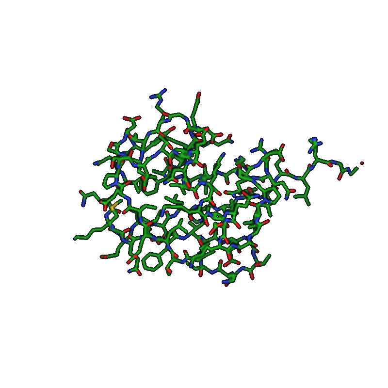
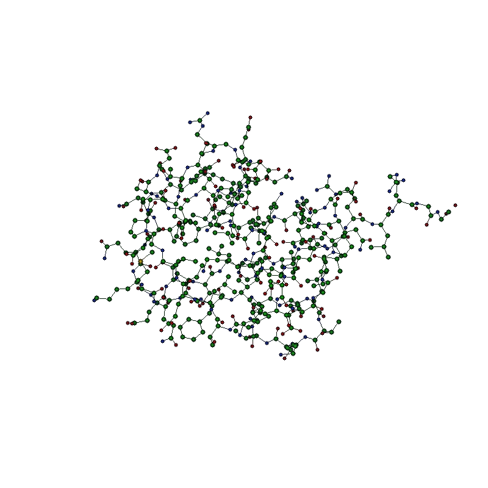
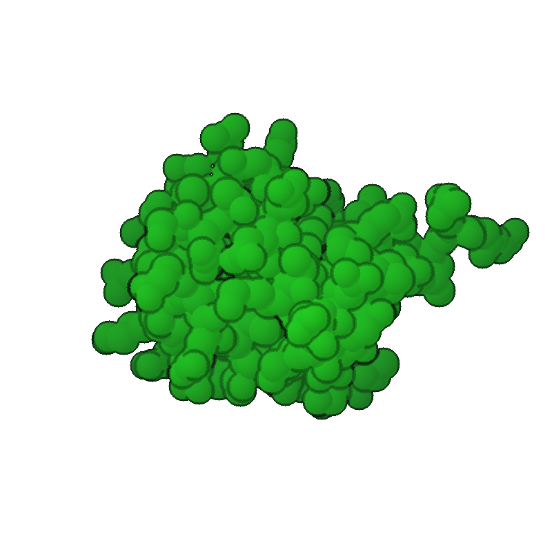
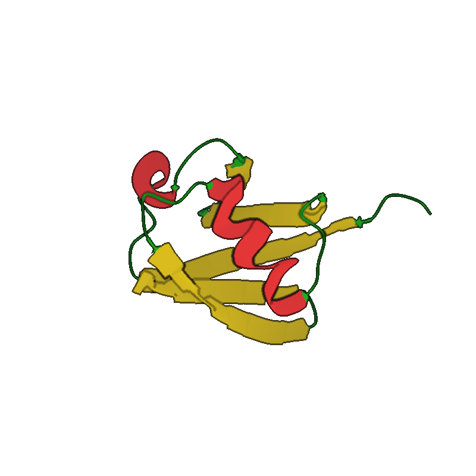
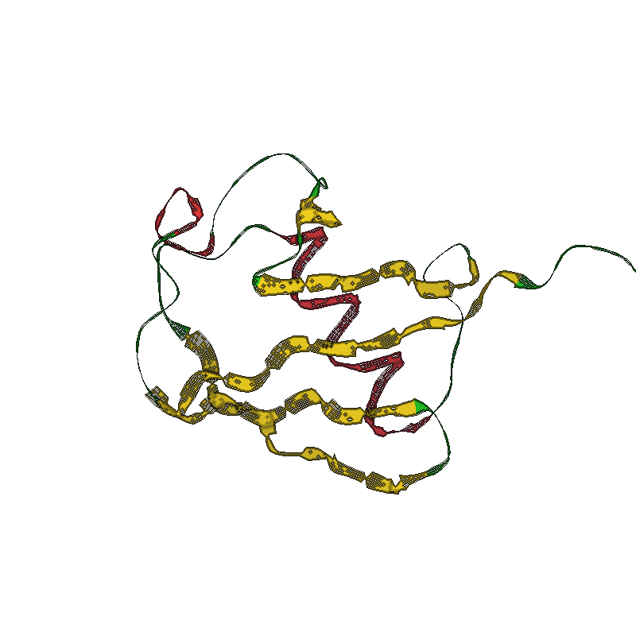
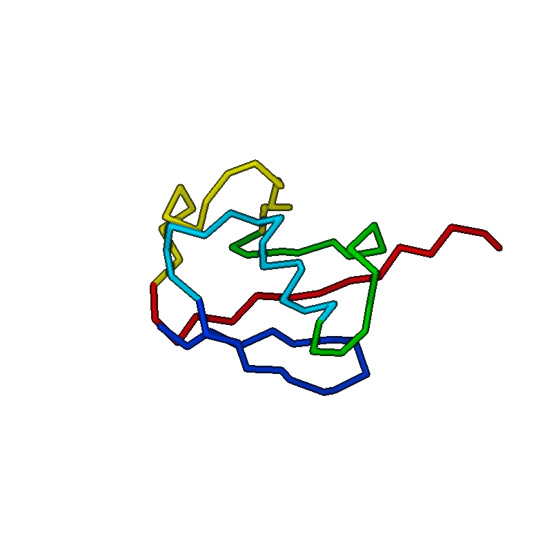

<p align="center">
  <strong>MolTerm</strong> — Terminal-based Molecular Viewer
  <br>
  <em>VIM-like interface &bull; Unicode &amp; pixel rendering &bull; PyMOL export</em>
</p>

<p align="center">
  
  
  
  
</p>

---

MolTerm renders 3D molecular structures directly in the terminal. It targets structural biologists and computational chemists who live in the terminal and want quick molecule inspection without launching a full GUI.

<p align="center">
  
  <br>
  <em>4HHB hemoglobin hetero-tetramer (α2β2) — cartoon: elliptical helix tubes, smoothstep SS transitions, chain coloring. Rendered offscreen in pixel mode at 300 DPI.</em>
</p>

### Press <code>m</code> — terminal-only Braille becomes pixel-perfect

<p align="center">
  
  <br>
  <em>Left: Unicode Braille — works in any terminal, no graphics protocol required.<br>
      Right: native pixel protocol (Sixel / Kitty / iTerm2) — toggled with one keypress (<code>m</code>).</em>
</p>

### Animation showcase

<p align="center">
  
  <br>
  <em>Every frame is a separate <code>:orient view</code> call — no rotate command, just a sweep of the view vector through the PCA frame.</em>
</p>

### Representation gallery

Each protein-rendering mode on `1ubq` (76-residue ubiquitin), 800×800 @
300 DPI, hero preset (`csd 24`, outline on, fog 0.4). Switch live with
the `s<key>` / `x<key>` keymaps or `:show <repr>`.

<table>
  <tr>
    <td align="center"><br><sub><code>show wireframe</code> · <code>color element</code></sub></td>
    <td align="center"><br><sub><code>show ballstick</code> · <code>color element</code></sub></td>
    <td align="center"><br><sub><code>show spacefill</code> · <code>color chain</code></sub></td>
  </tr>
  <tr>
    <td align="center"><br><sub><code>show cartoon</code> · <code>color secondary</code></sub></td>
    <td align="center"><br><sub><code>show ribbon</code> · <code>color secondary</code></sub></td>
    <td align="center"><br><sub><code>show backbone</code> · <code>color rainbow</code></sub></td>
  </tr>
</table>

### DNA and nucleic acids

<p align="center">
  
  <br>
  <em>1bna — flat-ribbon nucleic backbone. Bases rendered as polygonal prisms following actual ring atom positions: hexagonal pyrimidines (C/T in blue/cyan), L-shaped fused bicyclic purines (A/G in red/green), each with a thin stem connecting to C1' of the sugar.</em>
</p>

## Features

- **Smart defaults** — auto-detects protein/nucleic/ligand content: cartoon for macromolecules, wireframe for ligands, chain coloring (`gd` / `:preset` to re-apply)
- **3-tier bond detection** — standard residue table (20 AA + 8 nucleotides, with bond order) → inter-residue peptide/phosphodiester bonds → distance fallback for ligands
- **Multi-renderer pipeline** — Unicode Braille (8x resolution), half-block, ASCII, and native pixel protocols (Sixel, Kitty, iTerm2) with auto-detection
- **VIM-like modal interface** — Normal, Command, Search modes with trie-based multi-key bindings (`sw`, `dd`, `gt`, etc.)
- **Rich representations** — wireframe, ball-and-stick, spacefill, cartoon (Catmull-Rom spline + elliptical/tubular helix + tension-tuned spline + 3-point frame smoothing + smoothstep SS transitions + nucleic flat-ribbon backbone + hexagonal/bicyclic base ring prisms), flat ribbon, backbone trace — per-object or per-selection visibility
- **Selection algebra** — recursive descent parser: `chain A and helix`, `resi 50-60 or name CA`, boolean `and/or/not` with parentheses
- **Mouse selection** — `gs`/`gS`/`gc` pick modes for atom/residue/chain selection with `$sele` highlight overlay
- **Multi-level inspect** — click to inspect at atom/residue/chain/object level (`I` cycles), pick registers pk1-pk4 for measurements
- **Biological assemblies** — generate quaternary structures from PDB/mmCIF symmetry operators (`:assembly`)
- **Structure alignment** — TM-align and MM-align via USalign integration
- **PCA-aligned camera** — `:orient` runs full 3×3 eigendecomposition of atom positions; `:orient view <vx> <vy> <vz>` views the molecule along any direction expressed in its own PCA frame (e1=longest, e2=middle, e3=shortest)
- **Online fetch** — download from RCSB PDB (`fetch 1abc`) and AlphaFold DB (`fetch afdb:P12345`)
- **Headless batch mode** — `--no-tui` (or auto when stdout isn't a TTY) skips the alt-screen entirely so scripts render without flicker
- **Session management** — auto-save on quit, `--resume` to restore, `:save` for manual save
- **PyMOL session export** — `.pml` scripts with `set_view`, repr, coloring
- **Silhouette outlines** — depth edge detection with configurable threshold/darkness (pixel mode)
- **Screenshot from any renderer** — `:screenshot` renders offscreen via PixelCanvas even in braille/ASCII mode
- **Multi-state animation** — NMR ensemble / trajectory state cycling with `[`/`]` keys
- **Measurement tools** — `:measure`, `:angle`, `:dihedral` with pk1-pk4 pick registers, serial numbers, or `(selection)` endpoints; `:bond`/`:unbond` and `:disulfide` (auto-detect SG–SG pairs) for explicit connectivity in headless figures
- **Interface overlay** — `:interface` inter-chain contacts (closest heavy atom) with configurable dashed lines (works in all renderers including pixel mode); dashed lines respect z-buffer so atoms in front occlude them
- **Focus mode** — `gf`+click or `F` zoom to subject's bounding sphere; subject-size aware (one residue → tight, full chain → fits screen) with `focus_fill`/`focus_extra` knobs; granularity selectable (residue/chain/sidechain)
- **DSSP secondary structure** — full Kabsch-Sander pipeline: turns ▶ helices (3₁₀ / α / π) ▶ bridges (parallel / antiparallel) ▶ ladders with bulge propagation ▶ sheets, collapsed to molterm's 3-class SS. Auto-runs on load when no HELIX/SHEET headers exist. **Per-state cached** so trajectory frames (NMR/MD) get fresh SS when cycling with `[`/`]`. Re-run with `:dssp`. Validated against `mkdssp 4.5`: 13/15 PDB test structures match at 100% (4HHB, 1PGA, 1BTA, 1UBQ, 1ACJ, 1MBN, 1HHO, 1LMB, 2HHB, 2NLS, 2GB1, 1L2Y, 1CRN); 1AKE/7TIM at 99% (residual mismatches are H-bonds at exactly the −0.5 kcal/mol cutoff, where float precision flips the boundary)
- **Full customization** — keybindings, color themes, and settings via TOML configs in `~/.molterm/`
- **Structured logging** — session log to `~/.molterm/molterm.log`

## Quick Start

```bash
# Install latest release (macOS arm64, Linux x86_64/aarch64)
curl -fsSL https://raw.githubusercontent.com/vv137/molterm/main/scripts/update.sh | bash
# installs to ~/.local/bin/molterm. Override:
#   ./scripts/update.sh /usr/local/bin/molterm
#   MOLTERM_BIN=./build/molterm ./scripts/update.sh

# Or build from source
mkdir build && cd build
cmake .. -DCMAKE_BUILD_TYPE=Release
make -j$(nproc)

# Run
./molterm protein.pdb
./molterm structure.cif.gz             # gzipped files supported
./molterm --resume                     # restore last session (auto-saved on quit)
./molterm -r                           # short form
./molterm --script setup.mt            # run a command script after load (also -s)
./molterm --script setup.mt --strict   # abort on first script error (exit 1)
./molterm --script render.mt --no-tui  # batch render: no UI, no flicker
./molterm --help                       # full CLI help (also -h)
./molterm --version                    # prints version + git hash
```

### Headless screenshot example

A small script that fetches a PDB, orients the camera, switches to
cartoon, and writes a 1920×1080 PNG without ever opening a visible
viewport:

```text
# render.mt
fetch 1crn
hide all
show cartoon
color secondary
orient view 1 1 1
screenshot 1crn.png 1920 1080
quit
```

```bash
./molterm --script render.mt --no-tui
# → writes 1crn.png (1920×1080) into the cwd
```

`--no-tui` is auto-enabled whenever `--script` is used and stdout is
not a TTY (so piping or redirecting works the same way), and `--tui`
forces the UI on if you want to watch it run. `:screenshot file.png
[width height]` works from any renderer; the optional pixel dimensions
default to the live viewport (small under no-TTY) and are clamped to
64..8192 px.

### Camera orientation: `:orient view`

`:orient` aligns the camera to the molecule's principal axes via PCA
(largest variance → screen X, middle → Y, smallest → Z). `:orient view
<vx> <vy> <vz>` then chooses *which direction in that PCA frame the
camera looks from*. Default is `0 0 1`: down the shortest axis, so the
flattest face of the molecule fills the screen.

<p align="center">
  
</p>

The vectors are interpreted in the PCA basis, so the same view spec
gives a comparable framing across structures of different sizes and
orientations.

### Spinning animations: `:turn`

`:orient view` recomputes PCA on every call. For sweeping the camera
through many frames, do PCA once and then use `:turn x|y|z <deg>` to
apply incremental rotations around the screen axes:

```text
# spin.mt — 60 frames, ~6° per frame
load ./protein.pdb
show cartoon
orient view 0 0 1
# repeat 60×:
turn y 6
screenshot frames/f001.png 800 800
turn y 6
screenshot frames/f002.png 800 800
...
```

`:turn` skips the eigendecomposition entirely; only the camera rotation
matrix is updated. Combine with `ffmpeg -i frames/f%03d.png out.mp4`.

### Multi-model alignment: `:loadalign`

For comparing many models of the same molecule (AlphaFold ensembles,
CASP submissions, MD snapshots, NMR states), `:loadalign` glob-loads
files and superposes models 2..N onto the first in one step:

```text
:loadalign relaxed_model_*.pdb              " all *.pdb in cwd
:loadalign relaxed_model_{1..5}.pdb         " brace expansion
:loadalign models/*.cif mm                  " force MM-align (multi-chain)
```

A trailing **selection** is applied to *both* sides of every alignment —
useful for superposing on the confident core of an AlphaFold ensemble
while letting flexible loops or low-pLDDT regions float:

```text
:loadalign model_?.cif chain A+B            " align on chains A and B only
:loadalign af2_*.pdb resi 50-200            " align on the structured domain
:loadalign nmr_*.cif backbone               " backbone-only superposition
```

The split between file patterns and selection is the first token that
begins a Selection keyword (`chain`, `resi`, `pepseq`, `not`, …) —
see the **Selection Algebra** section. Selection comes after the
patterns, before any optional `tm`/`mm` mode.

`:alignto` gives you per-call control once everything is loaded:

```text
:alignto ref                                " every other obj → ref
:alignto chain A to ref chain A             " current obj's chain A → ref's chain A
:alignto chain A+B to model chain A+B       " same object on both sides is OK
                                            " (intra-object selection alignment)
```

**`automap`** trails `:align` / `:alignto` / `:loadalign` when the same
complex was deposited with different chain labels (e.g. TCR-pMHC where
one structure is A=HLA, B=β2m, C=peptide, D=TCRα, E=TCRβ and another
reorders to C=HLA, D=β2m, E=peptide, A=TCRα, B=TCRβ). It forces MM mode
and drops any caller-supplied selection so USalign sees the whole
assembly — USalign-MM (`-mm 1`) handles chain pairing + permutation
internally.

```text
:align top1_bt2 to ref_8yiv automap         " let USalign pair the chains
:alignto ref_8yiv automap                   " same, broadcast over the tab
```

`automap` rejects free-form per-side `chain X` / `chain X+Y` selections;
either strip them and let USalign do the matching, or use the
`chain=A,B,…` shorthand (issue #81) below — it's `automap`-compatible.

**`chain=A,B,…`** (issue #81) trails `:align` / `:alignto` / `:loadalign`
to restrict both sides to the listed chain IDs without writing the
verbose `chain A or chain B or …` expression. Use `chain1=`/`chain2=`
for asymmetric per-side filters:

```text
:align mob to ref chain=C,D,E                " pMHC-only superposition
:alignto ref chain=C,D,E                     " broadcast pMHC anchor
:align mob to ref automap chain=C,D,E        " auto-pair within the C,D,E subset
:align mob to ref chain1=A,B chain2=H,L      " heavy/light → A/B mapping
```

The chain list is folded into the selection expression before USalign
sees the temp PDB, so the same atom-level filter that drove per-side
`[sel]` arguments before now drives this shorthand — `chain=` and a
literal `chain X or chain Y` expression are interchangeable.

### Multi-object workflow

After `:loadalign` (or any multi-load), per-object commands (`:color`,
`:show`, `:hide`, the hotkey repr toggles, `:zoom`, `:center`, `:orient`)
fan out across **every loaded object** by default. PyMOL semantics: a
bare selection is interpreted per-object; narrow it with one of:

- **`obj <name>` keyword** — `chain E and obj model` (anywhere in the expression).
- **Slash form** `/objname/chain/resi/name` — `:color red /1abc/A//CA` (legacy).
- **Object-qualified parens** `<objname>/(<expr>)` (issue #37) — most readable
  for nested expressions: `:zoom 1ubq/(chain A and resi 50-80)`. Wildcard form
  `all/(<expr>)` and `*/(<expr>)` is symmetric to a bare `(<expr>)` but explicit
  about the intent. PDB-style digit-led names (`1ubq`, `7tcr`) work as the
  object qualifier without quoting. As of #55, `:count`, `:cmp`, and
  `:set transparency` resolve obj-qualified selections against the named
  object even when it isn't the `:object` current — previously they were
  pinned to the current object and silently returned 0 atoms.

`:zoom` / `:center` / `:orient` also skip `:disable`d objects in
broadcast mode — a disabled crystal reference loaded alongside a model
won't drag the camera bounding box off-canvas. Switch to
`:set scope current` (or `:!zoom`) if you need to frame a single
disabled object explicitly.

```text
:loadalign relaxed_model_*.pdb              " load + superpose 5 models
:color rainbow                              " all 5 colored rainbow
:color red, obj 1ubq                        " just one object
:color blue, /relaxed_model_3/A//           " chain A of one specific model (slash form)
:show ballstick model/(chain E)             " obj-qualified parens — only the named object
:hide cartoon crystal/(chain *)             " hide cartoon for everything in `crystal`
:color magenta model/(chain E and resi 7)   " arbitrary expression inside the parens
:zoom chain A                               " camera frames the union of chain A across all 5
```

Two knobs control scope:

```vim
:set scope current               " single-object mode (legacy behavior)
:set scope all                   " multi-object mode (default)
:get scope                       " query

:color! red, chain A             " ! flips scope for this one call
:show! cartoon                   "   (handy with scope=all when you want to
                                 "    tweak the current object only)
```

`:set scope current` in `~/.molterm/init.mt` restores the pre-multi-object
behavior permanently. Structure-mutating commands (`:delete`, `:rename`,
`:bond`, `:unbond`, `:assembly`) always operate on the current object
regardless of scope — switch the current object explicitly with
`:object`:

```vim
:object                          " print the current object's name + index
:object 1ubq                     " switch to that object by name
:object 2                        " switch by 1-based index (matches :objects)
:object next                     " cycle forward (also Tab in Normal mode)
:object prev                     " cycle backward
:copy [<obj-or-sel>] [as <name>] " Clone an object OR a selection's atoms.
                                "   Object form: whole-object deep copy (atoms,
                                "   bonds, reprs, colors, alpha). Defaults to
                                "   current; auto-names <name>_copy.
                                "   Selection form: subset() + bond-remap — keeps
                                "   only the matching atoms; bonds survive iff
                                "   both endpoints are kept; per-atom state
                                "   (color, alpha, repr masks) carries over.
                                "   Auto-names <name>_subset.
                                "   Source unchanged either way (non-destructive).
                                "   Examples:
                                "     :copy 1ubq as backup
                                "     :copy chain A as just_A
                                "     :copy byres within 5 of $hem as binding_site
:extract <sel> [as <name>]       " Cut atoms out of the current object into a new
                                "   MolObject (destructive). Like :copy <sel> but
                                "   the source loses those atoms. Auto-names
                                "   <name>_extract. Refuses to extract every atom
                                "   (use :rename if that's what you want).
                                "   Useful for "carve TCR out of TCR-pMHC complex
                                "   for independent alignment" workflows.
:split [<obj>] by chain          " Build one new MolObject per chain of <obj>
                                "   (current if omitted). Source unchanged — :rm
                                "   it after if you want pure chain-objects.
                                "   Names: <obj>_<chainId>. Useful for per-chain
                                "   alignment, per-chain color, or splitting a
                                "   TCR-pMHC complex into its 4-5 functional units.
:rename [<old>] <new>            " Rename an object (one-arg form renames current)
:delete [<name>]                 " Delete an object (defaults to current). Also
                                "   removes it from the active tab, not just the
                                "   ObjectStore — prior versions could leave a
                                "   dangling shared_ptr in the tab when called
                                "   by name.
:rm [<name>]                     " Alias for :delete
```

### Analysis recipes — `:run @lib/<name>` (issue #56)

The `lib/` directory ships short, validated `.mt` scripts for named
structural metrics — TCR-pMHC crossing/incident angle, eventually
antibody elbow, DNA bend, etc. — composed from the v0.31+ register
primitives (`:let` / `pos()` / `pca()` / `dot()` / `angle()`).

```vim
:setenv TCR_A D ; :setenv TCR_B E
:setenv MHC A   ; :setenv PEP C
:setenv MHC_HELIX1 50-85
:setenv MHC_HELIX2 138-175
:setenv TCRA_CYS23 22 ; :setenv TCRB_CYS23 23
:setenv PEP_FIRST 1   ; :setenv PEP_LAST 9
:run @lib/tcr_angles
:label corner topleft  = "crossing = ${crossing:.1f}°"
:label corner topright = "incident = ${incident:.1f}°"
```

`@lib/<name>` resolves against this lookup chain (first match wins):

1. `$MOLTERM_LIB_DIR/<name>.mt`
2. `~/.molterm/lib/<name>.mt`              ← user library, writable
3. `<install-prefix>/share/molterm/lib/<name>.mt` ← shipped recipes
4. `<exe-dir>/../lib/<name>.mt`            ← build-tree layout
5. `<source-dir>/lib/<name>.mt`            ← dev fallback

Forks live at `~/.molterm/lib/`; shipped baselines stay untouched. See
[`lib/README.md`](lib/README.md) for the recipe catalog with required
env vars, output registers, and a validated PDB example per recipe.

Shipped recipes declare a `#!molterm scope=local export=<names>`
shebang, so they run in their own register frame and only the named
output registers (`$crossing`, `$incident`, …) propagate back to the
caller. Internal scratch (`$_hlx1`, `$_groove`, …) stays contained —
the `_`-prefix is enforced as private at frame pop, so even an
accidental `:expose _hlx1` would be rejected.

### High-quality rendering

PNGs from `:screenshot` are produced by `PixelCanvas` regardless of the
live renderer, so quality is controlled by these knobs. Inside a `.mt`
script file, drop the leading `:` — the colon is interactive command-mode
syntax only; scripts pass each line straight to the command registry:

```text
# render.mt — example settings file
screenshot out.png 2048 2048       # up to 8192×8192
screenshot out.png 1800 1200 300   # 6×4 in @ 300 DPI for journals
set sm relative                    # rough/final renders match (issue #48)
set csd 24                         # cartoon spline subdivisions  (def 14)
set ch  1.6                        # helix half-width  Å           (def 1.30)
set csh 1.8                        # sheet half-width  Å           (def 1.50)
set cl  0.30                       # loop  tube radius Å           (def 0.20)
set outline on                     # silhouette outlines (pixel)
set ot 0.2                         # outline depth threshold       (def 0.3)
set od 0.2                         # outline darken (0=black)      (def 0.15)
set fog 0.4                        # atmospheric depth fog 0-1     (def 0.35)
```

(Same commands as `:screenshot …`, `:set …` typed interactively.)

**Resolution-independent framing (issue #98):** `:focus`, `:zoom`, and
`:orient` fit the subject's *projected* extent to the **actual** output
frame, recomputed for every `:screenshot` size. A view tuned at 1200×900
fills the frame identically at 2400×1800 — same framing, just more pixels —
and the fit is aspect-aware, so a wide or tall canvas no longer leaves the
molecule small with dead margins. Combined with the default
`size_mode relative` (labels scale with the canvas), a single script
round-trips between rough and hi-DPI renders. Manual pan/zoom or
`:camera load` drops the auto-fit so an explicit pose is preserved.

**Script syntax:** `#` starts a comment that runs to end-of-line — anything
after it is ignored, *including* `;`. So `# step 1; step 2` is a single
comment, not two commands. `;` (outside a comment) separates commands on
one line, useful for `:setenv`-style preamble or piping with `molterm -s -`.
A `#` inside `"..."` or `'...'` is preserved as part of the quoted argument.

**Env-var substitution:** `${NAME}` is expanded against in-process vars set
via `:setenv NAME value`, falling through to the OS environment, with
empty-string on unset. Use `\$` to write a literal dollar.

```text
:setenv WS  /store/casp17/H2324
:setenv TGT H2324
:run ${WS}/scripts/00_setup.mt
:load ${WS}/models/top1_bt2.cif
:screenshot ${WS}/figures/${TGT}-overview.png 1280 960
```

Expansion happens *after* `;` splits, so `:setenv X foo; :load ${X}/y` works
in one line. `:setenv NAME` (no value) unsets; bare `:setenv` lists all.

The optional 4th `screenshot` arg stamps a PNG `pHYs` chunk so LaTeX,
Word, and image viewers know the intended physical print size — pixel
count is unchanged, only metadata. Pick pixels = inches × DPI: a
6×4-inch journal figure at 300 DPI is `1800 1200 300`.

For a hero figure: 2048², `csd 24`, outline on, `fog 0.4`. For an
animation, drop to 800-1024² and lower `csd` if frame time matters.

### Dependencies

| Dependency | Version | Source |
|------------|---------|--------|
| **gemmi** | v0.7.0 | FetchContent (automatic) |
| **USalign** | latest | FetchContent (automatic) |
| **toml++** | v3.4.0 | FetchContent (automatic) |
| **ncurses** | system | `apt install libncurses-dev` / `brew install ncurses` |
| **zlib** | system | Usually pre-installed |

All C++ dependencies are fetched automatically by CMake. Only ncurses and zlib need to be installed on the system.

---

## Usage

### VIM-like Modes

| Mode | Entry | Exit | Purpose |
|------|-------|------|---------|
| **Normal** | `ESC` / `Ctrl+C` | — | Navigation, object manipulation, mouse inspect/select |
| **Command** | `:` | `ESC`, `Enter` | Typed commands with tab completion |
| **Search** | `/` | `ESC`, `Enter` | Selection expression search, `n`/`N` navigate |

### Keybindings (press `?` for in-app cheat sheet)

<details>
<summary><strong>Navigation</strong></summary>

| Key | Action |
|-----|--------|
| `h`/`j`/`k`/`l` or arrows | Rotate molecule |
| `W`/`A`/`S`/`D` | Pan view |
| `+`/`-` | Zoom in/out |
| `<`/`>` | Z-axis rotation |
| `0` | Reset view |
| `.` | Repeat last action |
| Scroll wheel | Zoom |

</details>

<details>
<summary><strong>Representations</strong> — <code>s</code>=show, <code>x</code>=hide</summary>

| Key | Action |
|-----|--------|
| `sw` / `xw` | Wireframe |
| `sb` / `xb` | Ball-and-stick |
| `ss` / `xs` | Spacefill (CPK) |
| `sc` / `xc` | Cartoon (3D tube) |
| `sr` / `xr` | Ribbon (flat) |
| `sk` / `xk` | Backbone trace |
| `xa` | Hide all |
| `so` / `xo` | Show / hide overlays (labels, measurements, sele) |
| `gd` | Apply default preset (cartoon + ballstick ligands) |

</details>

<details>
<summary><strong>Coloring</strong> — <code>c</code> prefix</summary>

| Key | Scheme |
|-----|--------|
| `ce` | Heteroatom element (N=blue O=red S=yellow, carbon unchanged) |
| `cc` | Chain |
| `cs` | Secondary structure |
| `cb` | B-factor |
| `cp` | pLDDT (AlphaFold confidence) |
| `cr` | Rainbow (N→C terminus) |
| `ct` | Residue type (nonpolar/polar/acidic/basic) |

</details>

<details>
<summary><strong>Objects, Tabs &amp; Other</strong></summary>

| Key | Action |
|-----|--------|
| `Tab` / `Shift+Tab` | Next/prev object |
| `Space` | Toggle visibility |
| `dd` | Delete object |
| `yy` / `p` | Yank / paste object |
| `gt` / `gT` | Next/prev tab |
| `Ctrl+T` / `Ctrl+W` | New/close tab |
| `o` | Toggle object panel |
| `i` | Inspect info (shows current level) |
| `I` | Cycle inspect level (atom/residue/chain/object) |
| Click | Inspect at current level (stores pk1→pk4 registers) |
| `gs` | Enter atom select mode (click to toggle atoms in `$sele`) |
| `gS` | Enter residue select mode (click to toggle residues) |
| `gc` | Enter chain select mode (click to toggle chains) |
| `gf` | Enter focus pick mode (click to focus) |
| `gx` | Clear `$sele` and pk1-pk4 |
| `ESC` | Exit pick mode / exit focus session / cancel pending |
| `[` / `]` | Prev/next state (NMR ensembles) |
| `m` | Toggle braille/pixel renderer |
| `P` | Screenshot (PNG, pixel renderer) |
| `I` | Toggle interface overlay |
| `F` | Focus on picked residue (subject-size aware zoom); press again to exit |
| `q` + `a-z` | Record macro |
| `@` + `a-z` | Play macro |
| `b` | Toggle sequence bar (visible / hidden) |
| `{` / `}` | Sequence bar prev/next chain |
| `?` | Help overlay |

</details>

### Commands

```vim
:help                           " Command index overlay (grouped by category)
:help <cmd>                     " Per-command overlay: usage, description, examples
:load <pattern>...              " Load mmCIF/PDB/gzipped file(s); supports shell globs and brace ranges:
                                "   :load *.pdb
                                "   :load model_{1..5}.cif
                                "   :load relaxed_*.pdb confident_*.cif
                                "   Idempotent on canonical source path: re-running
                                "   `:load same.cif` after an earlier load returns
                                "   "Loaded <name> (cached, same path)" instead of
                                "   creating a `_1`-suffixed duplicate. Re-runnable
                                "   batch-render scripts no longer stack overlapping
                                "   copies of the assembly. To force a refresh of an
                                "   already-loaded object, `:delete <name>` first.
:fetch <pdb_id>                 " Download from RCSB PDB (e.g. fetch 1abc)
:fetch afdb:<uniprot_id>        " Download from AlphaFold DB (e.g. fetch afdb:P12345)
:show <repr> [selection]         " Show repr (optionally for selection only); applies across scope (see Multi-object scope)
:hide [repr|all] [selection]    " Hide repr (optionally for selection only); applies across scope
:color <scheme>                 " element/cpk, chain, ss, bfactor, plddt, rainbow, restype, heteroatom, clear
:color <name> [selection]       " Per-atom color (red, blue, salmon, etc.) with optional selection
                                "   Multi-object: a bare selection covers every loaded object;
                                "   narrow with `obj <name>` or `/objname/...`. Append `!`
                                "   to flip scope for one call (e.g. `:color! red, chain A`).
:color "#RRGGBB" [selection]    " 24-bit hex literal — also `#RGB` short form and
:color "rgb(R,G,B)" [selection] "   `rgb(0..255, 0..255, 0..255)`. Pixel/screenshot output
                                "   honours the full 24-bit value; the 8-colour terminal
                                "   maps to the nearest named pair. Round-trips through
                                "   `:export *.pml` as PyMOL `0xRRGGBB` so figure scripts
                                "   keep the authored shade.
:select <expr>                  " Select atoms (see Selection Algebra below)
:select <name> = <expr>         " Named selection (e.g. :select s1 = $sele)
:select clear                   " Clear $sele and pk1-pk4 (also bound to gx)
:count <expr>                   " Count matching atoms
:cmp <expr-A> vs <expr-B>       " Compare two selections (Venn breakdown + verdict).
                                "   Prints |A| |B| |A∩B| |A\B| |B\A| and ends with
                                "   one verdict word — equal / A⊆B / B⊆A / disjoint /
                                "   overlap — which is greppable from scripts.
                                "   `vs` is the separator (= / , would be ambiguous).
                                "   Issue #53. Examples:
                                "     :cmp chain A vs chain B
                                "     :cmp $old_paratope vs $new_paratope
                                "     :cmp $paratope vs byres within 5 of $antigen
:center [selection]             " Center view
:zoom [selection]               " Center + zoom to fit
:orient [selection]             " Align principal axes + center + zoom
:orient view <vx> <vy> <vz>     " View along direction in PCA frame (also reruns PCA)
:turn x|y|z <deg>               " Rotate camera around screen axis (no PCA, cheap)
:align <obj> [sel] to <obj>     " TM-align via USalign
:mmalign <obj> [sel] to <obj>   " MM-align for complexes
:alignto <ref> [sel]            " Align every other object in tab onto <ref>
:alignto <sel> to <ref> [sel]   " Align current object onto <ref> (intra-object selection alignment allowed)
:loadalign <pattern> [sel] [tm|mm] " Glob/brace-load files; align all to the first
                                "   sel applies to both sides — e.g. confident domain only:
                                "   :loadalign model_?.cif chain A+B
:assembly [id|list]             " Generate biological assembly (default: 1)
:measure [s1 s2] [= "caption"]  " Distance (no args = pk1↔pk2 from last clicks).
                                "   Endpoints may also be two parenthesized
                                "   selections that each resolve to one atom:
                                "   :measure (resi 2 and name SG) (resi 30 and
                                "   name SG) = "C28-C56 SS"  — the headless way
                                "   to pin an atom by selection (no picking).
:angle [s1 s2 s3] [= "caption"] " Angle at s2 (no args = pk1-pk2-pk3).
:dihedral [s1 s2 s3 s4] [= "..."] " Dihedral (no args = pk1-pk4).
                                "   Args: serial number, pk1-pk4, or $selection.
                                "   Persisted as a dashed line + value label
                                "   (rendered into screenshots and exported as
                                "   PyMOL distance/angle/dihedral with `label`
                                "   carrying the optional caption).
:bond [s1 s2 | (selA) (selB)]   " Draw a bond between two atoms (real topology
                                "   edge → renders as a stick wherever both
                                "   atoms are shown in wireframe/ballstick).
:unbond [s1 s2 | (selA)(selB)]  " Remove a bond between two atoms.
:disulfide [selection]          " Auto-detect cysteine SG–SG pairs (1.6–2.5 Å)
                                "   and draw them as bonds. Whole structure by
                                "   default; pass a selection to limit scope.
                                "   Fills in disulfides that prediction models
                                "   (no struct_conn) omit from connectivity.
:label <selection>              " Show residue labels on viewport (text from
                                "   :set label_format, default <resname><resseq>)
:label corner <pos> = "text"     " Free-position label pinned to a viewport corner.
                                "   <pos>: topleft|topright|bottomleft|bottomright
                                "   (or short tl/tr/bl/br). Inset by ~half the label
                                "   font height from the edge.
:label screen <fx> <fy> = "text" " Free label at normalised viewport coords
                                "   (0,0) = top-left, (1,1) = bottom-right.
:label world <x> <y> <z> = "text" " Free label at an explicit 3D position; tracks
                                "   the camera so the label rotates with the model.
                                "   Useful for annotating an active site location
                                "   without picking a specific atom.
                                "   All free-label forms honor :set label_color and
                                "   :set label_font_size; supported in pixel mode.

" ── Persistent solid arrows / axes (issue #38) ───────────────────
" Distinct from :measure (dashed + auto distance) — a solid arrow with
" a triangular head reads as "this is an axis vector", which is what
" you want for the principal axis of a domain, the V-V axis of a TCR,
" or any directional annotation. Endpoints persist as world coords;
" atom-anchored arrows resolve once and don't re-track if atoms move
" (re-issue after :align).
:arrow <s1> <s2> [= "text"]      " Arrow from atom serial s1 to s2.
:arrow $regA $regB [= "text"]    " Arrow between two vec3-typed registers
                                "   (set via :let — see #32, #35).
:axis $pcaReg [= "text"]         " Major axis (axis1) of a pca-result
                                "   register, centered on its centroid,
                                "   length = ±1σ (√eigval) along that axis.
                                "   Composes naturally with `:let G = pca(<sel>)`.
:set arrow_color <c>             " Same color spec as label_color. Default: yellow.
:set arrow_thickness|at <n>      " Shaft pixel thickness, 1..10 (default: 2).
:set arrow_head_size|ahs <n>     " Arrowhead length in pixels, 2..32 (default: 8).
                                "   All three knobs scale by :set overlay_scale.
:label <selection> = "<text>"   " Override the label text for matched atoms
                                "   (e.g. :label name CA and resi 1 = "P1")
:label clear                    " Remove all labels and overrides (atom + corner/screen/world)
:unlabel [<selection>|corner [<which>]|screen|world]
                                " Remove labels (issue #58):
                                "   no arg               every atom label AND every free label
                                "   <selection>          atom labels matching the selection only
                                "   corner               every corner-anchored free label
                                "   corner topleft|tl|topright|tr|bottomleft|bl|bottomright|br
                                "                         that one corner only
                                "   screen | world       every screen-anchored / world-anchored free label
:overlay                        " Toggle overlay visibility (labels, measurements, sele)
:overlay clear                  " Clear all measurements, atom labels, free labels, arrows
:preset                         " Apply smart defaults (cartoon protein, ballstick ligands)
:run [--strict] [--fresh] <script.mt>
                                " Execute a command script (# comments supported).
                                "   --strict  Abort on the first failing command (CI-style).
                                "   --fresh   Clear overlay annotations (labels,
                                "             :measure / :angle / :dihedral) before
                                "             running, so a batch-render driver
                                "             (`:run --fresh fig1.mt; :run --fresh fig2.mt`)
                                "             does not leak fig1's labels into fig2.
                                "             Without --fresh, overlays accumulate
                                "             across :run calls — useful for layered
                                "             setup scripts, intentional caption stacks.
                                " Failures (issue #80) are reported as
                                "   `path:line: \`cmd\`: reason` to stderr (headless mode)
                                "   or `~/.molterm/molterm.log` (TUI mode); the cmdline
                                "   summary cites the first failure's file:line so the
                                "   first jump-to is one click away.
:save                           " Save session (auto-saved on quit). Persists
                                "   loaded objects, per-tab camera state, and
                                "   typed registers (`:let`) so `:resume` recovers
                                "   the exact register values without
                                "   re-evaluating their original expressions —
                                "   important when the source structure has
                                "   changed since the autosave.
:export <file.pml>              " Export session as PyMOL script
:screenshot [file.png] [W H [DPI]] " Save PNG; W H force off-screen size, optional DPI stamps pHYs metadata
:interface [cutoff]             " Toggle inter-chain contact overlay (closest heavy atom, default: 4.5Å)
:interface legend               " Overlay with interaction-color legend + per-type stats (focus-aware scope)
:focus <selection>              " Click-to-focus: zoom + isolate sidechains
                                "   Whole interacting residues are auto-promoted into the neighborhood
:focus off                      " Exit focus session, restore camera + reprs
:dssp                           " Recompute DSSP secondary structure for current state (per-state cached)
:set renderer <type>            " ascii, braille, block, pixel, sixel, kitty, iterm2
:set stereo off|walleye|crosseye " Side-by-side stereoscopic split. Walleye =
                                 "   parallel viewing (left image to left eye);
                                 "   crosseye = the user crosses their eyes.
:set stereo_angle <deg>         " Parallax angle (total, eyes ±half), default 6
:set fog <0-1>                  " Depth fog strength (default: 0.35)
:set bg|background_color <m>    " transparent (default) | white | black |
                                "   "#RRGGBB" | "#RGB" | "rgb(R,G,B)"
                                "   Named modes (transparent/white/black) and
                                "   arbitrary opaque RGB triples are both accepted —
                                "   a slate-grey publication background is
                                "   `:set bg "#202020"` or `:set bg "rgb(32,32,32)"`.
                                "   Honored in --no-tui and stable across sizes;
                                "   transparent uses a touched-pixel mask, not a
                                "   color heuristic, so labels and outline-darkened
                                "   atoms stay opaque. Custom RGB is always opaque;
                                "   for a transparent custom color, use the
                                "   transparent mode and post-process the PNG.
:set v|verbose on|off           " Stream diagnostic lines to stderr after each
                                "   command (off by default):
                                "     [view]   :center/:zoom/:orient/:turn/:focus
                                "              -> camera center, zoom, pan, atom count
                                "     [sel]    :select <name> = <expr>  ->  N atoms /
                                "              M residues [across chains A,B,...]
                                "     [align]  per (mobile,target) pair attempted by
                                "              :align / :alignto, with TM1/TM2/RMSD/Aligned
                                "     [render] :screenshot — PNG dims, DPI, bg, outline,
                                "              fog, elapsed seconds, visible_atoms
                                "   `[warn] :screenshot — 0 visible atoms; PNG will be
                                "   empty` is also printed to stderr regardless of
                                "   verbose, since silent empty PNGs are the most
                                "   common headless-script footgun.
:set transp|transparency <0..1> [selection]
                                " Per-atom transparency (0 = opaque, 1 = invisible);
                                "   selection narrows the application; no selection =
                                "   whole object. Pixel-mode only; transparent pixels
                                "   are skipped by the outline pass so glassy helices
                                "   don't carry a black silhouette.
:set outline on|off             " Silhouette outlines
:set ot|outline_threshold <n>   " Outline depth sensitivity (default: 0.3)
:set od|outline_darken <n>      " Outline darkness (default: 0.15, 0=black)
:set ch|cartoon_helix <n>       " Cartoon helix half-width Å (default: 1.30)
:set csh|cartoon_sheet <n>      " Cartoon sheet half-width Å (default: 1.50)
:set cl|cartoon_loop <n>        " Cartoon loop radius Å (default: 0.20)
:set csd|cartoon_subdiv <n>     " Cartoon spline subdivisions (default: 14)
:set csa|cartoon_aspect <n>     " Cartoon helix W:H aspect ratio (default: 5.0)
:set chr|cartoon_helix_radial <n> " Cartoon helix elliptical cross-section vertices (4-64, default: 16)
:set cth|cartoon_tubular_helix on|off " Tubular helix mode (circular tube vs elliptical ribbon, default: off)
:set ctr|cartoon_tubular_radius <n> " Tubular helix tube radius Å (default: 0.7)
:set bs_units vdw|cell          " BallStick sizing: vdw (Å×factor) or cell (legacy sub-pixel)
:set bsf|bs_factor <n>          " BallStick sizeFactor × vdW when bs_units=vdw (default: 0.15)
:set sfs|spacefill_scale <n>    " Spacefill ×vdW (default: 1.0, full vdW = CPK)
:set scope all|current           " Multi-object dispatch (default: all). With `all`, per-object
                                "   commands (color/show/hide, hotkey repr toggles, zoom/center)
                                "   apply to every object in the tab. Narrow with `obj <name>`
                                "   or `/objname/...` in the selection. `:cmd!` flips scope once.
:set panel on|off                " Object panel visibility
:set auto_center on|off          " Auto-center camera on load
:set seqbar on|off               " Sequence bar visibility
:set seqwrap on|off              " Sequence bar wrap mode
:set ic|interface_color <name>   " Interface overlay color (default: yellow)
:set it|interface_thickness <n>  " Interface dashed-line thickness, pixel mode (1-6, default: 4)
:set is|interface_show <spec>    " Which interaction types draw dashes:
                                "   all | specific | none | <list of hbond,salt,hydrophobic,other>
                                "   Lists may use ',' or '+' as separator: :set is hbond,salt
                                "   Examples: :set is hbond,salt          :set is hbond+salt
                                "             :set is hbond,salt,hydrophobic
                                "   Default 'specific' = hbond + salt only.
                                "   The legend stats remain complete regardless.
:set bt <n>                     " Backbone trace thickness, cells (default: 0.5)
:set wt <n>                     " Wireframe line thickness, cells (default: 0.35)
:set br <int>                   " BallStick legacy sub-pixel radius (default: 1, only when bs_units=cell)
:set ff|focus_fill <0.05-1.0>    " Focus fill fraction — fraction of screen the subject occupies (default: 0.6)
:set fe|focus_extra <Å>          " Focus extra radius padding around the subject (default: 4.0)
:set fmr|focus_min_radius <Å>    " Focus minimum radius clamp (default: 2.0)
:set fr|focus_radius <Å>         " Focus neighborhood cutoff (default: 5.0)
:set fd|focus_dim <0-1>          " Focus dim strength for non-subject atoms (default: 0.55)
:set fg|focus_granularity <g>    " residue|chain|sidechain — what gf+click expands to (default: residue)
:set lf|label_format <fmt>       " Default :label text template (empty = <resname><resseq>)
                                "   Tokens: {resname} {resseq}/{seqid} {chain} {name} {element} {restype}
                                "   Example: :set lf "P{resseq}"   then  :label name CA and resi 1-10
                                "   gives P1..P10. Per-atom :label sel = "text" overrides the template.
:set lfs|label_font_size <px>   " :label font size in pixels (default: 14, range: 8..72).
                                "   Independent of cell size — keeps labels legible on
                                "   2400x1800 / 4800-DPI screenshots where the cell-derived
                                "   default would shrink them to ~6 pt.
:set anf|annotation_font_size <px>
                                " :measure / :angle / :dihedral caption font size in
                                "   pixels (default: 14, range: 8..72).
:set anlw|annotation_linewidth <px>
                                " :measure dashed-line thickness (default: 2 sub-pixels,
                                "   range: 1..8).
:set scale|overlay_scale <x>     " Global multiplier on label_font_size, annotation_font_size,
                                "   annotation_linewidth, and the $sele/pk yellow rings
                                "   (default: 1.0, range: 0.5..4.0). Quick toggle between
                                "   rough (1.0) and hi-DPI (2.0) renders.
:set sm|size_mode <mode>         " How label / annotation / arrow sizes scale across
                                "   different render resolutions:
                                "     relative  — (default) interpret sizes as "pixels at
                                "                 reference_canvas_height tall canvas".
                                "                 :screenshot W H rescales by
                                "                 canvasH/refH so labels stay the same
                                "                 fraction of the figure across resolutions
                                "                 — a 1200x900 rough render and a 2400x1800
                                "                 final render show the same figure.
                                "     pixels    — raw screen pixels. lfs 22 is always
                                "                 22 px, so a hi-DPI render shows labels
                                "                 tiny relative to the canvas. Pre-0.45
                                "                 behavior; set this for byte-stable
                                "                 small-canvas output.
                                "     physical  — interpret sizes as point sizes (1 pt =
                                "                 live_dpi/72 px). :screenshot W H DPI
                                "                 then auto-rescales by DPI/live_dpi so
                                "                 lfs 22 prints at ~22 pt regardless of
                                "                 the screenshot's DPI metadata. Closer to
                                "                 how scientific journals expect figure
                                "                 sizing to work.
                                "   With the default `relative`, keep the same lfs / anf
                                "   for both rough and final :screenshot — they round-trip.
:set reference_canvas_height <h> " Canvas height (px) at which `lfs N`/`anf N` mean N
                                "   pixels under size_mode = relative. Default: 1080
                                "   (range: 240..8192). Larger value = labels shrink
                                "   relative to the figure at the same lfs.
:set live_dpi <d>                " DPI assumed for the live render under
                                "   size_mode = physical. Default: 96 (range: 36..600).
                                "   Affects only the auto-rescale ratio; live label
                                "   pixel size is still lfs * overlay_scale.
:set label_color <c>            " Color for :label text. Accepts named (red, white,
                                "   black, salmon, slate, …), hex (#RRGGBB / #RGB),
                                "   or rgb(R,G,B). Default: white. Set to `default`
                                "   (or `clear` / `auto` / `off`) to revert.
                                "   Pixel mode only — ncurses fallback uses palette.
:set annotation_color <c>       " Color for :measure / :angle / :dihedral captions.
                                "   Same color spec as label_color. Default: yellow.
:set measurement_line_color <c>  " Color for :measure / :angle / :dihedral dashed lines.
                                "   Same color spec. Default: yellow. Independent of
                                "   the caption color so a dim line + bright caption
                                "   pairing (or vice versa) is one knob away.
:set outline_color <c>          " Color used by silhouette / both outline modes.
                                "   Same color spec. Default: black (which is what
                                "   `darken` happens to converge to). Honored by
                                "   silhouette + both modes; ignored by edge mode.
:set label_outline on|off        " Halo (text outline) for :label glyphs (issue #49,
                                "   default off). When on, drawTextOutlinedRGB
                                "   paints a contrasting rim around each glyph
                                "   before the body color, so labels stay legible
                                "   against any local pixel — coloured atoms,
                                "   ribbon interior, dark/light bg. Pixel mode
                                "   only — ncurses fallback ignores it.
:set label_outline_color <c>    " Halo color. Same spec as label_color (named,
                                "   #RRGGBB, rgb(R,G,B), or `default` to clear).
                                "   When unset (default), molterm picks
                                "   white-on-dark / black-on-light against the
                                "   body color so the toggle alone is usually
                                "   enough.
:set label_outline_thickness <px>
                                " Halo radius in pixels (default: 2, range: 1..6).
                                "   Computed as a Chebyshev (square) dilation of
                                "   the glyph alpha mask, so thickness 1 reads
                                "   as a one-pixel ring even on small text.
:set annotation_outline on|off   " Halo for :measure / :angle / :dihedral
                                "   captions and arrow captions (default off).
                                "   Same auto-color logic as label_outline.
:set annotation_outline_color <c>
                                " Halo color for annotation glyphs. Same spec.
:set annotation_outline_thickness <px>
                                " Halo radius for annotation glyphs (default: 2,
                                "   range: 1..6).
:set outline_mode edge|silhouette|both
                                " Outline post-pass behavior:
                                "     edge        — legacy behavior; darken edge pixels
                                "                   by `outline_darken`. Works on light
                                "                   bg; invisible on dark bg (darken-
                                "                   of-black is still black).
                                "     silhouette  — paint silhouette pixels a fixed
                                "                   color (outline_color). Closes the
                                "                   dark-bg gap — pair with a light
                                "                   outline_color for a Mariuzza-style
                                "                   light rim on a dark hero figure.
                                "     both        — silhouette paint + edge darken;
                                "                   colored rim with subtle interior
                                "                   depth-edge darkening on top.
:get <option>                    " Query current value of any :set option (for scripting)
:let <name> = <expr>             " Bind a typed register (scalar / vec3 / pca-result)
                                "   for reuse in later commands. Closes #32, #33, #35.
                                "   Expression supports:
                                "     - Scalars: 1.5, -3
                                "     - Vec3 literals: [1, 0, 0]
                                "     - Atom positions: pos(A:1:CA)         (chain:resi:atom)
                                "                      pos(1ubq/A:1:CA)    (obj qualifier, issue #66)
                                "     - Register refs: $G.axis1, $v.length
                                "                      (bare names also work: G.axis1)
                                "     - Vector algebra: + - * /, dot(), cross(),
                                "                      length(), normalize(), midpoint(),
                                "                      angle()       (degrees)
                                "     - Scalar math:   abs, sqrt, exp, log, log10, log2,
                                "                      sin, cos, tan, asin, acos, atan,
                                "                      floor, ceil, round
                                "                      (2-arg) min, max, pow, atan2
                                "     - PCA primitive: pca(<selection>)     -> { axis1,
                                "                      axis2, axis3, eigvals, center }
                                "   Type rules: vec±vec, scalar±scalar, scalar*vec,
                                "   vec/scalar, dot/cross/length/angle on vec3.
                                "   Examples:
                                "     :let v_axis = pos(A:43:CA) - pos(B:23:CA)
                                "     :let drift  = length(pos(model/A:50:CA) -
                                "                          pos(ref/A:50:CA))
                                "     :let G      = pca(chain A and helix)
                                "     :let theta  = abs(angle(v_axis, G.axis1))
:unlet <name> | :unlet *         " Drop one named register, or all of them.
:registers                       " List every register and its current value.
:expose <name> [<name>...]       " Mark registers for export from a scope=local
                                "   script frame to the caller (issue #67). Names
                                "   starting with `_` are auto-private. Outside
                                "   a scope=local frame, no-op.
:echo <text>                     " Print to stdout after ${var} / ${reg:fmt} expansion.
                                "   LLM-agent-friendly: machine-readable output without
                                "   relying on the status bar. Useful for scripted
                                "   analysis pipelines:
                                "     :let crossing = angle($v_proj, $p_proj)
                                "     :echo crossing_deg=${crossing:.2f}

" ── Script scope & call args (issue #67) ──────────────────────────────
" By default (back-compat), a `:run` script reads/writes the same
" register and env namespace as the caller — convenient for in-place
" recipes, but it means a library script's temporaries can leak into
" the caller. The first line of a script can opt into a local frame:
"
"   #!molterm scope=local export=crossing,incident
"   let _scratch = 99      # `_`-prefix never escapes the script
"   let crossing = 28.0    # only listed names flow back to caller
"   let incident = 12.5
"
" The shebang grammar is `#!molterm key=value ...`. Recognised keys:
"   scope=local|inherit (default: inherit)
"   export=name1,name2,...
" In-script `:expose` adds names dynamically; `_`-prefixed names are
" silently dropped to enforce privacy.
"
" Call-site arguments (KEY=VALUE) implicitly trigger scope=local:
"
"   :run @lib/tcr_angles TCR_A=D TCR_B=E MHC=A PEP=C MHC_HELIX1=50-85
"
" The KEY=VALUE pairs land in the script's env (visible as `${TCR_A}`
" etc.) and are popped when the script exits. The caller's env is
" untouched.

" ── Control flow (issue #68) ──────────────────────────────────────────
" Scripts support :if / :elseif / :else / :endif and numeric :foreach.
" Conditions go through the :let expression evaluator on both sides
" of a comparison (==, !=, <, >, <=, >=).
"
"   :let crossing = angle($v_proj, $p_proj)
"   :if $crossing > 60
"   :  label corner topleft = "warning: atypical crossing"
"   :elseif $crossing > 30
"   :  label corner topleft = "canonical crossing"
"   :else
"   :  label corner topleft = "shallow crossing (8YIV-like)"
"   :endif
"
" Numeric range iteration:
"
"   :foreach i in 1..5
"   :  run @lib/render_one i=${i}
"   :end
"
" Nested :if and :foreach work; loop variable is set as a scalar
" register on each iteration. Iteration over selections / lists is
" not yet supported — use a :let-driven calculation if you need
" per-residue logic for now.

" ── ${name.field[:fmt]} interpolation ───────────────────────────────
" Inside any string-typed argument (`:setenv`, `:label`, `:measure ...= caption`,
" etc.), references to registers + a printf-style format spec are expanded
" before the command sees them. Lookup order: registers, scriptEnv (set by
" :setenv), process getenv. Examples:
"     ${theta:.2f}            -> 12.34
"     ${v.length:.1f}         -> 8.7
"     ${V.x:.4f}              -> 1.0000
"     ${G.center}             -> (1.230, 4.560, 7.890)   (vec3 default fmt)
"     ${G.center:.2f}         -> (1.23, 4.56, 7.89)      (per-component fmt)
:set / :set all                  " (no value) Print every queryable option's
                                "   current value, one per line — Vim parity for
                                "   `:set all`. The list is the canonical option
                                "   table, so a freshly-added knob shows up here
                                "   automatically. Use this to discover option
                                "   names before scripting `:get <opt>`.
:camera                          " Print the current camera state (rotation 3x3,
                                "   center XYZ, zoom, pan XY) as a key=value blob
                                "   suitable for pasting into a script.
:camera save <file>              " Write the camera state to <file>. The file
                                "   is forward-compatible: a `# molterm camera v1`
                                "   header version-tags it, and unknown keys are
                                "   silently ignored on load.
:camera load <file>              " Restore camera state from a file written by
                                "   `:camera save`. Makes figure scripts
                                "   bit-reproducible — without this, every render
                                "   starts from a freshly-PCA'd pose and tiny
                                "   structural changes silently shift the camera.
:camera reset                    " Reset to the default identity-rotation /
                                "   zoom-1.0 / pan-0,0 pose.
:info                           " Show atom/bond count
:q                              " Quit
```

### Selection Algebra

Recursive descent parser with boolean operators. Used by `:select`, `:count`, `:color`, and `/` search.

```vim
:select chain A and helix                " helix residues in chain A
:select resi 50-60 or name CA            " residue range or all Cα atoms
:select not water and not hydro          " heavy atoms, no water
:select backbone and chain B             " backbone of chain B
:select active = resi 100-120 and chain A
:select site = $sele                     " save mouse selection to named selection
:color red $active                       " use named selection with $
:show cartoon chain A                    " show cartoon only for chain A
/helix and chain A                       " search with n/N navigation
```

**Cross-object narrowing** — when `:set scope all` is in effect (the
default after multi-load), use `obj <name>` or the slash form to scope
the same selection to a specific object. PDB-style names that start
with a digit (`1ubq`, `7bz5`) are accepted as a single token:

```vim
:color red, obj 1ubq                  " just one of N loaded structures
:color blue, /relaxed_model_3/A//     " chain A of one specific model
:show cartoon, obj 2def and chain A   " combine with other predicates
```

**IMGT-canonical CDR / FR regions** (issue #36) — `imgt <region>` selects
the standard IMGT residue range for an antibody / TCR variable domain.
Assumes the chain is **already IMGT-numbered** (e.g. by an upstream
ANARCI pass — molterm doesn't compute the renumbering itself). Combine
with `chain X` to scope to a single chain. Region names and residue
ranges (per imgt.org):

| keyword | residue range |
|---|---|
| `fr1`            | 1-26    |
| `cdr1`           | 27-38   |
| `cdr1_anchored`  | 26-39   |
| `fr2`            | 39-55   |
| `cdr2`           | 56-65   |
| `cdr2_anchored`  | 55-66   |
| `fr3`            | 66-104  |
| `cdr3`           | 105-117 |
| `cdr3_anchored`  | 104-118 |
| `fr4`            | 118-128 |

The `_anchored` variants (issue #83) include the conserved framework
positions that bookend each CDR — Cys23/26-Cys104 for the V-domain
core disulfide, Trp/Phe118 for the FR4 anchor — so `imgt cdr3_anchored`
gives the canonical C-X-X-X-X-W/F bracket form used in many
structural papers.

**IMGT positions** (issue #84) — alongside the named regions, `imgt`
also accepts numeric forms for single positions, inclusive ranges, and
'+'-separated sets:

```vim
:select e108 = chain B and imgt 108              " single IMGT position
:select cdr3core = chain B and imgt 107-115      " range
:select glus  = chain B and imgt 106+108+115     " set
:select mixed = chain B and imgt 105-110+115     " range + set mixed
:zoom chain B and imgt 108                       " frame the load-bearing residue
```

```vim
:select cdr3a = chain A and imgt cdr3            " TCR α-chain CDR3 (105-117)
:select cdr3b = chain B and imgt cdr3_anchored   " TCR β with C/F anchors
:show ballstick chain A and imgt cdr3
:color magenta chain B and imgt cdr3
```

The same ranges work for antibody heavy/light chain CDRs since IMGT
numbering is unified across V-domain types. Unknown region names
return an empty selection rather than failing — keeps batch scripts
robust against typos in domain-specific keywords. **Position counts
are data-dependent**: a 9-aa CDR3-β with IMGT gaps at 109-112 returns
9 residues, but a chain renumbered with the gaps *filled in* will
return all 13 positions — the selector trusts the residue numbers it
sees, ANARCI must produce the canonical gap pattern upstream.

**Spatial proximity** — `within N of <expr>` selects atoms ≤ N Å from any
atom matching the inner expression; `exwithin` is the same minus the
inner set itself (useful for finding "neighbors not including self"):

```vim
:select within 4.5 of resn HEM           " every atom near a heme
:select exwithin 4.5 of chain A           " contacts of chain A on other chains
:select within 6 of $sele                 " expand mouse selection to neighbors
:show sticks within 5 of resi 100         " sidechains in the binding pocket
```

**Whole-residue / whole-chain expansion** — `same KW as <expr>` (where
`KW` is `residue`, `chain`, or `resname`/`resn`) promotes a per-atom
selection up to the enclosing residue, chain, or all residues of the
same type. Common with `within`, which returns individual atoms:

```vim
:select same residue as within 5 of resn HEM   " entire residues touching a heme
:select same chain as resn ATP                  " every chain that binds ATP
:select same resname as resn HIS                " all histidines in the structure
```

**Peptide-sequence search** — `pepseq <one-letter-codes>` (alias `seq`,
`sequence`) matches contiguous residue runs whose one-letter codes spell
the pattern. `.` and `?` are single-residue wildcards; matches never
cross chain breaks. Works with the rest of the algebra:

```vim
:select pepseq KVL                  " every Lys-Val-Leu run (β-globin motif)
:select pepseq H.L                  " His-anything-Leu (3-residue wildcard pattern)
:select chain B and pepseq KVL      " same motif but only in chain B
:show sticks pepseq GXG and chain A " glycine kinks
```

**Mouse selection workflow:**

1. `gs` (atom), `gS` (residue), or `gc` (chain) to enter select mode
2. Click to toggle atoms/residues/chains in `$sele` (status bar shows count)
3. `ESC` to exit select mode
4. `:select mysite = $sele` to save, `:color red $mysite`, `:show cartoon $mysite`
5. `:select clear` to reset

**Pick registers for measurement:**

1. Click atoms in inspect mode — each click stores pk1→pk2→pk3→pk4 (rotating)
2. `:measure` (distance pk1↔pk2), `:angle` (pk1-pk2-pk3), `:dihedral` (pk1-pk4)
3. Results shown as dashed lines + labels on viewport
4. `:overlay` to toggle visibility, `:overlay clear` to remove all

**Slash notation:** `/obj/chain/resi/name` — hierarchical selection (empty = wildcard)

```vim
//A/42/CA                       " chain A, residue 42, atom CA
//A+B/10-50                     " chains A and B, residues 10-50
/1abc//42                       " object 1abc, all chains, residue 42
//A                             " chain A, all residues
```

**Keywords:** `all`, `chain`, `resn`, `resi` (range), `name`, `element`, `helix`, `sheet`, `loop`, `backbone`/`bb`, `sidechain`/`sc`, `hydro`, `water`, `het`/`ligand`, `protein`, `nucleic`, `dna`, `rna`, `polymer`, `obj`, `$name`

**Spatial / expansion:** `within N of <expr>`, `exwithin N of <expr>`, `same residue as <expr>`, `same chain as <expr>`, `same resname as <expr>` (alias `resn`); `byres <expr>` / `bychain <expr>` are sugar for `same residue|chain as <expr>` (issue #52)

**Sequence search:** `pepseq <one-letter-codes>` (aliases: `seq`, `sequence`); `.` / `?` = single-residue wildcard

**Operators:** `and`, `or`, `minus`, `xor`, `not`, `( )`, `+` (OR shorthand: `chain A+B`, `resi 10+20+30-40`)

**Set algebra examples (issue #52):**

```vim
:select paratope = chain H+L and within 5 of chain G
:select paratope_only = $paratope minus $epitope     " atoms in paratope not in epitope
:select interface   = $paratope xor $epitope         " atoms in exactly one side
:count byres $paratope                                " entire residues touching the antigen
:select bb_interface = backbone and bychain $paratope " whole chains, backbone only
```

`minus` and `xor` sit at the same precedence as `or` (left-associative); use parentheses when mixing with `and` to be explicit (`(chain A and resi 1-50) minus name CA`). `-` is *not* an operator — it stays reserved for residue ranges like `resi 1-10`.

---

## Rendering

### Canvas Backends

| Backend | Resolution | Characters | Best for |
|---------|------------|------------|----------|
| **BrailleCanvas** (default) | 8× (2×4 sub-pixels) | Unicode Braille `⠀`–`⣿` | SSH, most terminals |
| **BlockCanvas** | 2× (1×2 sub-pixels) | Half-blocks `▀▄█` | Wide compatibility |
| **AsciiCanvas** | 1× | `* @ - \| /` | Legacy terminals |
| **PixelCanvas** | Native pixels | Sixel / Kitty / iTerm2 | Local terminals with graphics support |

**PixelCanvas features:** sphere shading (Half-Lambert), line shading, depth fog, frame diff, adaptive frame skip, LOD for >10K atoms.

Switch at runtime: `:set renderer braille|block|ascii|pixel` or `m` to toggle.

### Color Schemes

| Scheme | Key | Description |
|--------|-----|-------------|
| Heteroatom | `ce` | N=blue O=red S=yellow P=magenta (carbon unchanged) |
| Chain | `cc` | 12-color cycle (green, cyan, magenta, yellow, red, blue, orange, lime, teal, purple, pink, slate) |
| Secondary structure | `cs` | Helix=red Sheet=yellow Loop=green |
| B-factor | `cb` | Blue→Green→Red gradient |
| pLDDT | `cp` | AlphaFold confidence (>90 blue, 70-90 light blue, 50-70 yellow, <50 orange) |
| Rainbow | `cr` | Per-chain N→C terminus blue→red gradient |
| Residue type | `ct` | VMD-like: nonpolar (white), polar (green), acidic (red), basic (blue) |

**Per-atom coloring:** `:color <name> [selection]` — 15 named colors: `red green blue yellow magenta cyan white orange pink lime teal purple salmon slate gray`

---

## Customization

Configuration files in `~/.molterm/`:

```
~/.molterm/
├── config.toml          # general settings (default renderer, auto-center, etc.)
├── keymap.toml          # custom keybindings (overrides defaults)
├── colors.toml          # custom color schemes
├── init.mt              # auto-run command script (optional)
└── molterm.log          # session log (auto-created)
```

<details>
<summary><strong>init.mt — startup command script</strong></summary>

If `~/.molterm/init.mt` exists, MolTerm runs it on startup right after commands are registered, before any positional file args, `--script`, or `--resume`. Use it for preferred defaults so they apply to every session. Failures are logged to `molterm.log` but never abort startup (CLI `--strict` only applies to `--script`, not `init.mt`).

```text
# ~/.molterm/init.mt — no leading `:` in script files
set renderer pixel
set fog 0.4
set outline on
```

</details>

<details>
<summary><strong>keymap.toml example</strong></summary>

```toml
[normal]
"h"         = "rotate_left"
"j"         = "rotate_down"
"k"         = "rotate_up"
"l"         = "rotate_right"
"H"         = "pan_left"
"J"         = "pan_down"
"K"         = "pan_up"
"L"         = "pan_right"
"+"         = "zoom_in"
"-"         = "zoom_out"
"0"         = "reset_view"
"gt"        = "next_tab"
"gT"        = "prev_tab"
"<C-t>"     = "new_tab"
"<C-w>"     = "close_tab"
"sw"        = "show_wireframe"
"sb"        = "show_ballstick"
"sc"        = "show_cartoon"
"sr"        = "show_ribbon"
"ce"        = "color_by_element"
"cc"        = "color_by_chain"
"/"         = "enter_search"
"?"         = "show_help"
"["         = "prev_state"
"]"         = "next_state"

[command]
"<CR>"    = "execute"
"<Esc>"   = "exit_to_normal"
"<Tab>"   = "autocomplete"
```

</details>

<details>
<summary><strong>All bindable actions</strong></summary>

**Navigation:** `rotate_left`, `rotate_right`, `rotate_up`, `rotate_down`, `rotate_cw`, `rotate_ccw`, `pan_left`, `pan_right`, `pan_up`, `pan_down`, `zoom_in`, `zoom_out`, `reset_view`, `center_selection`, `redraw`

**Representations:** `show_wireframe`, `show_ballstick`, `show_spacefill`, `show_cartoon`, `show_ribbon`, `show_backbone`, `hide_wireframe`, `hide_ballstick`, `hide_spacefill`, `hide_cartoon`, `hide_ribbon`, `hide_backbone`, `hide_all`, `show_overlay`, `hide_overlay`, `apply_preset`

**Coloring:** `color_by_element`, `color_by_chain`, `color_by_ss`, `color_by_bfactor`, `color_by_plddt`, `color_by_rainbow`, `color_by_restype`

**Objects:** `next_object`, `prev_object`, `toggle_visible`, `delete_object`, `yank_object`, `paste_object`, `rename_object`, `toggle_panel`

**Tabs:** `next_tab`, `prev_tab`, `new_tab`, `close_tab`, `move_to_tab`, `copy_to_tab`

**Modes:** `enter_command`, `enter_search`, `exit_to_normal`

**Search:** `search_next`, `search_prev`

**Inspect / Selection:** `inspect`, `cycle_inspect_level`, `enter_select_atom`, `enter_select_residue`, `enter_select_chain`

**State:** `prev_state`, `next_state`

**Other:** `show_help`, `undo`, `redo`, `repeat_last`, `toggle_pixel`, `toggle_seqbar`, `seqbar_next_chain`, `seqbar_prev_chain`, `screenshot`, `start_macro`, `play_macro`, `toggle_interface`

**Command mode:** `execute`, `autocomplete`, `history_prev`, `history_next`, `delete_word`, `clear_line`

**Command line editing:** `Left`/`Right` cursor, `Home`/`Ctrl+A` start, `End`/`Ctrl+E` end, `Del` forward delete, `Ctrl+W` delete word, `Ctrl+U` clear

</details>

<details>
<summary><strong>colors.toml example</strong></summary>

```toml
[schemes.element]
C  = "green"
N  = "blue"
O  = "red"
S  = "yellow"
P  = "magenta"
H  = "white"
_default = "white"

[schemes.chain]
_cycle = ["green", "cyan", "magenta", "yellow", "red", "blue",
          "orange", "lime", "teal", "purple", "pink", "slate"]

[schemes.ss]
helix = "red"
sheet = "yellow"
loop  = "green"

[schemes.bfactor]
gradient = ["blue", "green", "red"]
min = 0.0
max = 100.0
```

</details>

---

## Architecture

```
molterm/
├── CMakeLists.txt
├── include/molterm/
│   ├── app/         Application, TabManager, Tab
│   ├── analysis/    ContactMap (interface detection, distance matrix)
│   ├── core/        MolObject, AtomData, BondData, Selection, ObjectStore, SpatialHash, Logger
│   ├── io/          CifLoader, Aligner, SessionExporter
│   ├── render/      Canvas (Braille/Block/Ascii/Pixel), Camera, ColorMapper, DepthBuffer
│   │                GraphicsEncoder (Sixel/Kitty/iTerm2), ProtocolPicker
│   ├── repr/        Representation (Wireframe/BallStick/Backbone/Spacefill/Cartoon/Ribbon)
│   ├── tui/         Screen, Window, Layout, StatusBar, CommandLine, TabBar, ObjectPanel,
│   │                SeqBar, DensityMap, ContactMapPanel
│   ├── input/       InputHandler, Keymap (trie), KeymapManager, Action, Mode
│   ├── cmd/         CommandParser, CommandRegistry, UndoStack
│   └── config/      ConfigParser (TOML)
└── src/             .cpp implementations mirror include/ structure
```

### Rendering Pipeline

```
MolObject → Representation → Canvas → Window (ncurses)
                 ↑                ↑
   ColorMapper (scheme)     Camera (3×3 rot + pan + zoom)
```

### Coding Conventions

- **C++17** strict — no exceptions in hot paths
- `std::unique_ptr` / `std::shared_ptr` with clear ownership
- `enum class` over raw enums
- `#pragma once` for header guards
- **Naming:** `PascalCase` types, `camelCase` methods/variables, `UPPER_SNAKE` constants
- All ncurses calls through `Screen`/`Window` wrappers
- Separate concerns: parsing (io/), model (core/), rendering (render/ + repr/), TUI (tui/), input (input/), commands (cmd/)

---

## PyMOL Export

Export the current session as a `.pml` script that reconstructs the view in PyMOL:

```
:export session.pml
```

Generates `load`, `show`, `color`, `select`, and `set_view` commands with the current camera matrix.

---

## Implementation Status

### Phase 1: Foundation — DONE

- [x] CMakeLists.txt with gemmi (FetchContent) + ncurses
- [x] Screen/Window — ncurses RAII wrappers
- [x] MolObject + CifLoader — gemmi mmCIF/PDB parsing, spatial hash bond detection + `_struct_conn`
- [x] Camera — 3×3 rotation matrix, orthographic projection, zoom, pan
- [x] AsciiRenderer — basic wireframe rendering (legacy, replaced by Canvas in Phase 2)
- [x] InputHandler — trie-based multi-key sequences, 4-mode state machine
- [x] Layout — TabBar, Viewport, ObjectPanel, StatusBar, CommandLine
- [x] Commands — :load, :q, :show, :hide, :color, :zoom, :tabnew, :tabclose, :objects, :delete, :rename, :info, :help, :set
- [x] Tab system — multiple tabs, copy/move objects between tabs
- [x] SIGWINCH resize handling

### Phase 2: Rich Rendering — DONE

- [x] Canvas abstraction — abstract sub-pixel drawing (drawDot, drawLine, drawCircle)
- [x] BrailleCanvas — 2×4 sub-pixel Unicode Braille, 8× resolution
- [x] BlockCanvas — 1×2 sub-pixel Unicode half-blocks, 2× resolution
- [x] AsciiCanvas — 1×1 fallback with directional line chars
- [x] DepthBuffer — Z-sorting at sub-pixel resolution
- [x] ColorMapper — element/chain/SS/B-factor color schemes
- [x] WireframeRepr — half-bond coloring, atom dots
- [x] BallStickRepr — filled circles with adaptive radius
- [x] BackboneRepr — Cα/P chain trace (protein + nucleic acid)
- [x] Mouse support — scroll wheel zoom, tab bar click
- [x] Runtime renderer switching — `:set renderer ascii|braille|block`

### Phase 3: VIM Features + Selection — DONE

- [x] Selection algebra — recursive descent parser: chain, resn, resi (range), name, element, helix/sheet/loop, backbone/sidechain, hydro, water, and/or/not/parens
- [x] Search — `/` parses selection expression, `n`/`N` navigate matches with atom details
- [x] Undo/Redo — UndoStack with push/undo/redo, 100-entry limit, `u`/`Ctrl+R` bindings
- [x] SpacefillRepr — VDW spheres, back-to-front sorted, scale adjustable
- [x] CartoonRepr — SS-aware Cα trace (thick helix, wide sheet, thin loop)
- [x] Commands — `:select <expr>`, `:select name = expr`, `:count <expr>`, `:sele`
- [x] Named selections — stored in map, `:sele` lists with atom counts
- [x] Per-atom coloring — 15-color palette, `:color <name> <selection>`, overrides scheme
- [x] `$name` references — `$sele`, `$ala` etc. in selection expressions
- [x] Auto-sele — every selection result auto-saved as `sele`
- [x] `obj` keyword — `obj myprotein` selects all atoms if object name matches
- [x] Inspect mode — mouse click picks atoms at configurable level (atom/residue/chain/object), `I` cycles level
- [x] Command history — `:` shows last 5 commands overlay, `↑`/`↓` cycle, 200 limit
- [x] USalign integration — `:align`, `:mmalign`, `:super` with per-side selection and `-ter 0`

### Phase 4: Customization + Export — DONE

- [x] ConfigParser — TOML config loading from `~/.molterm/` via toml++ v3.4.0
- [x] KeymapManager TOML — fully customizable keybindings from `keymap.toml`
- [x] Color schemes — user-defined color themes from `colors.toml`
- [x] SessionExporter — `.pml` script generation with `set_view`, repr, coloring
- [x] `:fetch` — download structures from RCSB PDB (`fetch 1abc`) and AlphaFold DB (`fetch afdb:P12345`)
- [x] pLDDT — AlphaFold confidence color scheme, `cp` keybinding, `:color plddt`
- [x] Macro recording — `q` + register (a-z) to record, `@` + register to play
- [x] Tab completion — context-aware for commands, filenames, object names, repr names, color names, settings
- [x] `$` selection prefix — `$sele`, `$ala` etc. (changed from `@`)

### Phase 4.5: PixelCanvas + Graphics — DONE

- [x] PixelCanvas — RGB framebuffer with pluggable GraphicsEncoder (Sixel/Kitty/iTerm2)
- [x] ProtocolPicker — auto-detect terminal graphics protocol via env vars
- [x] KittyEncoder — zlib compression + chunked base64 + atomic image replacement
- [x] ITermEncoder — OSC 1337 inline image protocol with BMP encoding
- [x] SixelEncoder — 6×6×6 color cube quantization + RLE + transparent background
- [x] Depth fog — post-pass atmospheric perspective, configurable via `:set fog`
- [x] Sphere shading — Half-Lambert lighting on filled circles (Spacefill/BallStick)
- [x] Line shading — depth-based intensity on wireframe/backbone/cartoon
- [x] Z-axis rotation — `<`/`>` keys for roll
- [x] Projection cache — `prepareProjection()` per frame, `projectCached()` per vertex
- [x] LOD — skip atom dots for >10K atom wireframe
- [x] Adaptive frame skip — skip 1-3 frames when render > 100ms
- [x] Frame diff — skip identical frames via RGB memcmp
- [x] Rainbow color scheme — per-chain N→C blue→red gradient, `cr` keybinding
- [x] Gzipped PDB/CIF — transparent `.gz` support via gemmi
- [x] `-v`/`--version` — git tag or dev+hash

### Phase 5: Polish — DONE

- [x] **Help system** — `?` keybinding cheat sheet overlay; `:help` command index (grouped by category, auto-built from the registry); `:help <cmd>` shows usage, description, and examples for a single command
- [x] **Measurement tools** — `:measure`, `:angle`, `:dihedral` with pick registers (pk1-pk4) or serial numbers
- [x] **Multi-state animation** — `[`/`]` state cycling for NMR ensembles; state shown in status bar
- [x] **Ribbon geometry** — Catmull-Rom spline ribbon with C→O guide vectors, sheet arrowheads, cross-fill
- [x] **Logging** — structured logging to `~/.molterm/molterm.log` with timestamped session markers

### Phase 5.5: Smart Defaults + Interaction — DONE

- [x] **3-tier bond detection** — standard residue table (20 AA + 8 NA with bond order) → peptide/phosphodiester inter-residue → distance fallback for ligands
- [x] **Smart default repr** — auto-detect protein/NA/ligand: cartoon for macromolecules, wireframe for ligands, chain coloring
- [x] **`:preset` / `gd`** — re-apply smart defaults on demand
- [x] **VMD-like residue type coloring** — `ct` / `:color restype` (nonpolar/polar/acidic/basic)
- [x] **Mouse-only inspect** — click to inspect at atom/residue/chain/object level, `I` cycles
- [x] **Pick registers** — pk1→pk4 rotating, used by `:measure`/`:angle`/`:dihedral` (no args)
- [x] **Mouse selection modes** — `gs` atom, `gS` residue, `gc` chain, click to toggle in `$sele`
- [x] **Selection highlight** — `$sele` atoms shown as `*` overlay on viewport
- [x] **Per-selection show/hide** — `:show cartoon chain A`, `:hide wireframe helix`
- [x] **Biological assembly** — `:assembly [id|list]` via gemmi `make_assembly()`
- [x] **Session autosave** — auto-save on quit, `--resume` / `-r` to restore, `:save` manual
- [x] **Offscreen screenshot** — `:screenshot` works in any renderer (offscreen PixelCanvas)
- [x] **SSH optimizations** — BrailleCanvas diff-flush, projection dedup, Bresenham depth step

### Phase 6: Annotation + Scripting — DONE

- [x] **Atom/residue labels** — `:label <selection>` rendered on viewport, `:label clear` / `:unlabel` to remove
- [x] **Measurement display** — dashed lines + distance/angle values drawn between measured atoms on viewport
- [x] **`:run` script** — execute `.mt` command script files for automation (`:run setup.mt`)
- [x] **BlockCanvas diff flush** — cell-level dirty tracking (same as BrailleCanvas) for SSH

### Phase 6.9: Scripting Polish — DONE

- [x] **Structured `ExecResult`** — commands return `{ok, msg}` instead of bare strings; enables proper error propagation
- [x] **`-s`/`--script <file>` CLI flag** — run a command script after init, before entering the REPL
- [x] **`--strict` flag** — script errors abort startup (exit 1) for both `--script` and `:run --strict`
- [x] **`init.mt` auto-loader** — runs `~/.molterm/init.mt` on startup before files/`--script`/`--resume`; failures logged but never block REPL

### Phase 6.5: Sequence Bar — DONE

- [x] **Sequence bar** — all chains shown across multiple wrapped rows; hidden by default (press `b`)
- [x] **`b` to toggle** — two-state: visible (full sequences) ↔ hidden
- [x] **Auto-scroll** — centers on inspected/clicked residue (legacy single-line mode)
- [x] **Chain switcher** — `{`/`}` to cycle active chain (legacy single-line mode)
- [x] **Selection highlight** — `$sele` atoms shown in reverse video
- [x] **Color by scheme** — SS, chain coloring on sequence text
- [x] **Click to navigate** — click residue to center camera; in focus mode (or `gf` pick mode), click refocuses on that residue

### Phase 6.8: Selection + Rendering — DONE

- [x] **Slash notation** — `/obj/chain/resi/name` hierarchical selection (empty = wildcard): `//A/42/CA`, `//A+B/10-50`
- [x] **`+` operator** — OR shorthand: `chain A+B`, `resi 10+20+30-40`, `name CA+CB+N`
- [x] **Heteroatom coloring** — `ce` / `:color element` now colors N/O/S/P by element, carbon unchanged
- [x] **Command line editing** — `Left`/`Right` cursor, `Home`/`End`, `Del`, fast input (no viewport re-render)
- [x] **Canvas::drawTriangle** — scanline rasterizer with bounding box clamp (all canvases)
- [x] **Silhouette outlines** — depth edge detection + 2px thick dark outlines (pixel mode, `:set outline on`)
- [x] **Lambert shading** — pixel triangle 20-100% intensity, braille stamp radius 65-100%
- [x] **Cartoon braille** — SS-dependent thick lines (helix=1.2, sheet=1.8 wide, loop=0.4), sheet arrowheads
- [x] **Configurable parameters** — `:set outline/ot/od`, `:set ch/csh/cl/csd` for cartoon radii/subdivisions

### Phase 7: Analysis + Visualization

- [x] **Interface overlay** — `:interface [cutoff]` inter-chain contact dashed lines (closest heavy atom, configurable color/thickness, works in all renderers)
- [x] **Analysis panel** — right-column split layout (ObjectPanel + AnalysisPanel), per-component dirty flags
- [x] **DensityMap renderer** — reusable half-block (▀▄█) heatmap component for 2D density visualization
- [x] **Heatmap colors** — 5-step blue→red gradient (kColorHeatmap0-4) in ncurses + PixelCanvas RGB
- [x] **Pixel-mode overlays** — measurement/interface/selection overlays draw into PixelCanvas directly
- [x] **PyMOL viewport size** — `:export` now includes `viewport 1280, 960` for standard figure dimensions
- [x] **Contact map** (hidden) — `:contactmap [cutoff]` Cα-Cα distance heatmap panel (available via command)
- [x] **Geometric SS fallback** — φ/ψ Ramachandran classifier with 3+/4+ run smoothing, runs when a file has no HELIX/SHEET records (CASP TS, AlphaFold, raw coords)
- [x] **DSSP-quality SS** — Kabsch & Sander H-bond model with n-turn helix (α / 3₁₀ / π) + bridge β-sheet detection + ladder propagation with bulge connection (`:dssp`, per-state cached for trajectories). Validated against `mkdssp 4.5` on 15 PDB structures: 13 match at 100% (incl. 4HHB, 1PGA, 1BTA, 1UBQ, 1ACJ); 1AKE / 7TIM at 99% — remaining mismatches are H-bonds at exactly the −0.5 kcal/mol cutoff. Optional 8-class output not yet exposed
- [x] **Pixel-mode label rendering** — embedded TTF (SpaceMono-Regular) rasterized via stb_truetype into the RGB framebuffer; covers residue labels, measurement values, and $sele/pk highlight rings in both live pixel mode and offscreen `:screenshot`
- [ ] **Solvent-accessible surface** — Shrake-Rupley SAS, rendered as silhouette contour or filled mesh
- [x] **Stereoscopic view** — `:set stereo walleye|crosseye` splits the viewport into two ±half-angle Y-rotated renders; `:set stereo_angle <deg>` (default 6°) controls parallax. Labels, measurements, focus-dim, and interface overlay all render per eye. `:export` emits the matching `stereo` / `set stereo_angle` lines so the same view loads in PyMOL
- [ ] **Electrostatic coloring** — Coulombic surface color from partial charges

### Phase 8: Export + Generation

- [ ] **Animation export** — rotate/state-cycle → GIF or APNG (`:record spin 360 out.gif`)
- [ ] **Crystal packing** — symmetry mates from `UnitCell` (`:symmates [radius]`)
- [ ] **SMILES input** — `:smiles CCO` → simple 3D coordinate generation

### Optimization Backlog

- [x] Frustum culling — BallStick/Backbone skip off-screen atoms (Wireframe, Spacefill already had it)
- [x] Spatial hash for picking — `findNearestAtom` O(N) → O(1) via 2D grid (20px cells, 3×3 query)
- [x] Spacefill depth pre-sort — sort only when camera dirty, reuse sorted order across frames
- [ ] Compile-time bond table — `constexpr` static initialization

---

## License

MIT
