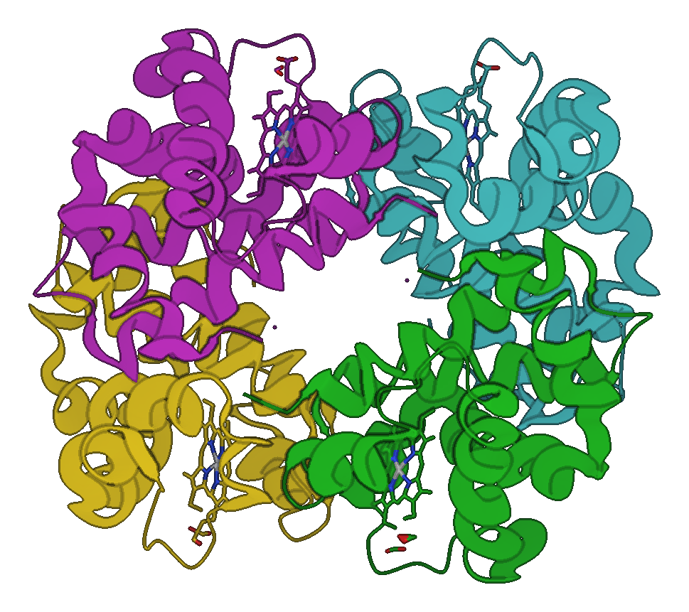
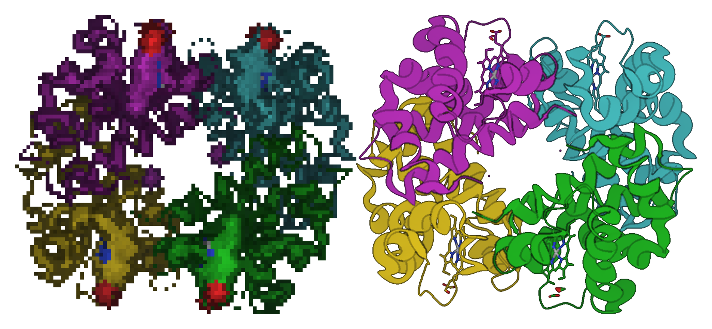
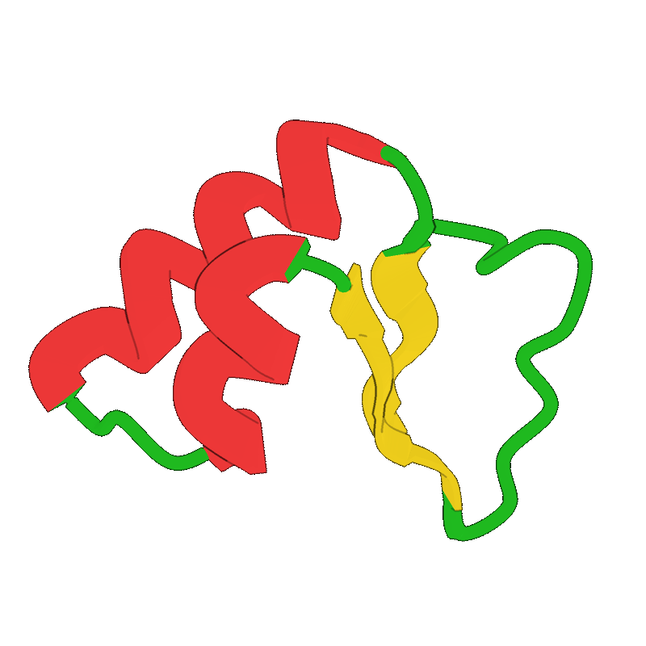
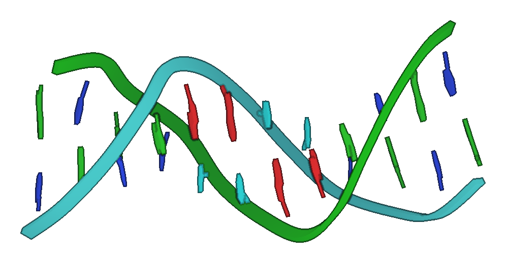
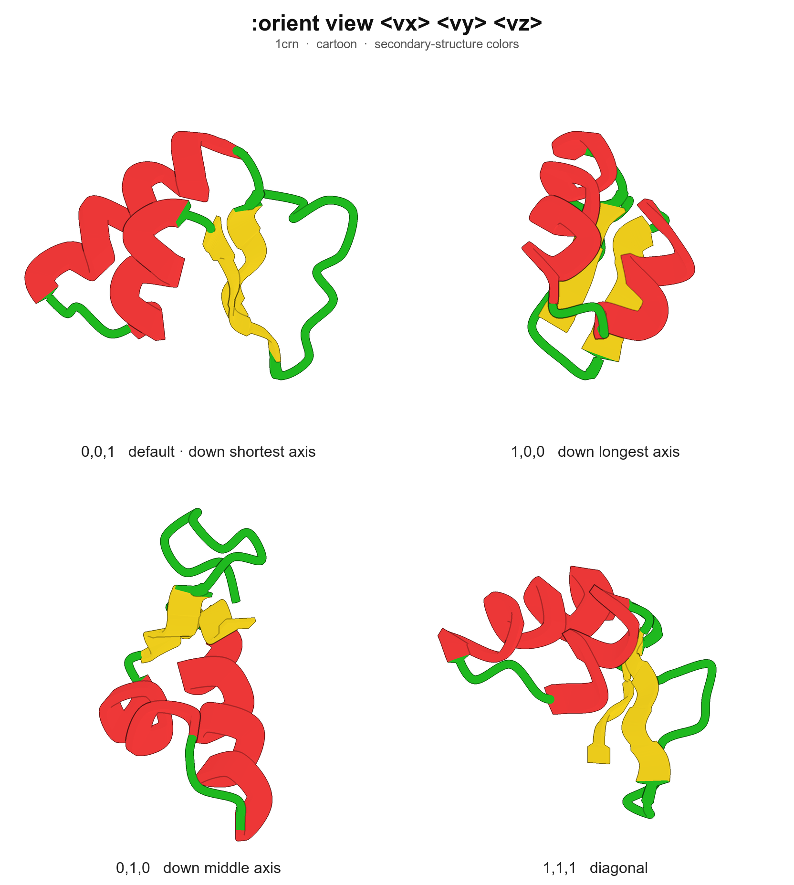

<p align="center">
  <strong>MolTerm</strong> — Terminal-based Molecular Viewer
  <br>
  <em>VIM-like interface &bull; Unicode &amp; pixel rendering &bull; PyMOL export</em>
</p>

<p align="center">
  
  
  
  
</p>

---

MolTerm renders 3D molecular structures directly in the terminal. It targets structural biologists and computational chemists who live in the terminal and want quick molecule inspection without launching a full GUI.

<p align="center">
  
  <br>
  <em>4HHB hemoglobin hetero-tetramer (α2β2) — Mol*-aligned cartoon: elliptical helix tubes, smoothstep SS transitions, chain coloring. Rendered offscreen in pixel mode at 300 DPI.</em>
</p>

### Press <code>m</code> — terminal-only Braille becomes pixel-perfect

<p align="center">
  
  <br>
  <em>Left: Unicode Braille — works in any terminal, no graphics protocol required.<br>
      Right: native pixel protocol (Sixel / Kitty / iTerm2) — toggled with one keypress (<code>m</code>).</em>
</p>

### Animation showcase

<p align="center">
  
  <br>
  <em>Every frame is a separate <code>:orient view</code> call — no rotate command, just a sweep of the view vector through the PCA frame.</em>
</p>

### DNA and nucleic acids

<p align="center">
  
  <br>
  <em>1bna — flat-ribbon nucleic backbone (Mol* <code>nucleicProfile='square'</code>). Bases rendered as polygonal prisms following actual ring atom positions: hexagonal pyrimidines (C/T in blue/cyan), L-shaped fused bicyclic purines (A/G in red/green), each with a thin stem connecting to C1' of the sugar.</em>
</p>

## Features

- **Smart defaults** — auto-detects protein/nucleic/ligand content: cartoon for macromolecules, wireframe for ligands, chain coloring (`gd` / `:preset` to re-apply)
- **3-tier bond detection** — standard residue table (20 AA + 8 nucleotides, with bond order) → inter-residue peptide/phosphodiester bonds → distance fallback for ligands
- **Multi-renderer pipeline** — Unicode Braille (8x resolution), half-block, ASCII, and native pixel protocols (Sixel, Kitty, iTerm2) with auto-detection
- **VIM-like modal interface** — Normal, Command, Search modes with trie-based multi-key bindings (`sw`, `dd`, `gt`, etc.)
- **Rich representations** — wireframe, ball-and-stick, spacefill, cartoon (Catmull-Rom spline + Mol*-aligned elliptical/tubular helix + tension-tuned spline + 3-point frame smoothing + smoothstep SS transitions + nucleic flat-ribbon backbone + hexagonal/bicyclic base ring prisms), flat ribbon, backbone trace — per-object or per-selection visibility
- **Selection algebra** — recursive descent parser: `chain A and helix`, `resi 50-60 or name CA`, boolean `and/or/not` with parentheses
- **Mouse selection** — `gs`/`gS`/`gc` pick modes for atom/residue/chain selection with `$sele` highlight overlay
- **Multi-level inspect** — click to inspect at atom/residue/chain/object level (`I` cycles), pick registers pk1-pk4 for measurements
- **Biological assemblies** — generate quaternary structures from PDB/mmCIF symmetry operators (`:assembly`)
- **Structure alignment** — TM-align and MM-align via USalign integration
- **PCA-aligned camera** — `:orient` runs full 3×3 eigendecomposition of atom positions; `:orient view <vx> <vy> <vz>` views the molecule along any direction expressed in its own PCA frame (e1=longest, e2=middle, e3=shortest)
- **Online fetch** — download from RCSB PDB (`fetch 1abc`) and AlphaFold DB (`fetch afdb:P12345`)
- **Headless batch mode** — `--no-tui` (or auto when stdout isn't a TTY) skips the alt-screen entirely so scripts render without flicker
- **Session management** — auto-save on quit, `--resume` to restore, `:save` for manual save
- **PyMOL session export** — `.pml` scripts with `set_view`, repr, coloring
- **Silhouette outlines** — depth edge detection with configurable threshold/darkness (pixel mode)
- **Screenshot from any renderer** — `:screenshot` renders offscreen via PixelCanvas even in braille/ASCII mode
- **Multi-state animation** — NMR ensemble / trajectory state cycling with `[`/`]` keys
- **Measurement tools** — `:measure`, `:angle`, `:dihedral` with pk1-pk4 pick registers or serial numbers
- **Interface overlay** — `:interface` inter-chain contacts (closest heavy atom) with configurable dashed lines (works in all renderers including pixel mode); dashed lines respect z-buffer so atoms in front occlude them
- **Mol*-style focus mode** — `gf`+click or `F` zoom to subject's bounding sphere; subject-size aware (one residue → tight, full chain → fits screen) with `focus_fill`/`focus_extra` knobs; granularity selectable (residue/chain/sidechain)
- **DSSP secondary structure** — internal Kabsch-Sander assignment (3-10/α/π helix + parallel/antiparallel β-bridges) collapsed to molterm's 3-class SS. Auto-runs on load when no HELIX/SHEET headers exist. **Per-state cached** so trajectory frames (NMR/MD) get fresh SS when cycling with `[`/`]`. Re-run with `:dssp`
- **Full customization** — keybindings, color themes, and settings via TOML configs in `~/.molterm/`
- **Structured logging** — session log to `~/.molterm/molterm.log`

## Quick Start

```bash
# Build
mkdir build && cd build
cmake .. -DCMAKE_BUILD_TYPE=Release
make -j$(nproc)

# Run
./molterm protein.pdb
./molterm structure.cif.gz             # gzipped files supported
./molterm --resume                     # restore last session (auto-saved on quit)
./molterm -r                           # short form
./molterm --script setup.mt            # run a command script after load (also -s)
./molterm --script setup.mt --strict   # abort on first script error (exit 1)
./molterm --script render.mt --no-tui  # batch render: no UI, no flicker
./molterm --help                       # full CLI help (also -h)
./molterm --version                    # prints version + git hash
```

### Headless screenshot example

A small script that fetches a PDB, orients the camera, switches to
cartoon, and writes a 1920×1080 PNG without ever opening a visible
viewport:

```text
# render.mt
fetch 1crn
hide all
show cartoon
color secondary
orient view 1 1 1
screenshot 1crn.png 1920 1080
quit
```

```bash
./molterm --script render.mt --no-tui
# → writes 1crn.png (1920×1080) into the cwd
```

`--no-tui` is auto-enabled whenever `--script` is used and stdout is
not a TTY (so piping or redirecting works the same way), and `--tui`
forces the UI on if you want to watch it run. `:screenshot file.png
[width height]` works from any renderer; the optional pixel dimensions
default to the live viewport (small under no-TTY) and are clamped to
64..8192 px.

### Camera orientation: `:orient view`

`:orient` aligns the camera to the molecule's principal axes via PCA
(largest variance → screen X, middle → Y, smallest → Z). `:orient view
<vx> <vy> <vz>` then chooses *which direction in that PCA frame the
camera looks from*. Default is `0 0 1`: down the shortest axis, so the
flattest face of the molecule fills the screen.

<p align="center">
  
</p>

The vectors are interpreted in the PCA basis, so the same view spec
gives a comparable framing across structures of different sizes and
orientations.

### Spinning animations: `:turn`

`:orient view` recomputes PCA on every call. For sweeping the camera
through many frames, do PCA once and then use `:turn x|y|z <deg>` to
apply incremental rotations around the screen axes:

```text
# spin.mt — 60 frames, ~6° per frame
load ./protein.pdb
show cartoon
orient view 0 0 1
# repeat 60×:
turn y 6
screenshot frames/f001.png 800 800
turn y 6
screenshot frames/f002.png 800 800
...
```

`:turn` skips the eigendecomposition entirely; only the camera rotation
matrix is updated. Combine with `ffmpeg -i frames/f%03d.png out.mp4`.

### High-quality rendering

PNGs from `:screenshot` are produced by `PixelCanvas` regardless of the
live renderer, so quality is controlled by these knobs (all settable
from a script):

```text
:screenshot out.png 2048 2048       # up to 8192×8192
:screenshot out.png 1800 1200 300   # 6×4 in @ 300 DPI for journals
:set csd 24                         # cartoon spline subdivisions  (def 14)
:set ch  1.6                        # helix half-width  Å           (def 1.30)
:set csh 1.8                        # sheet half-width  Å           (def 1.50)
:set cl  0.55                       # loop  tube radius Å           (def 0.40)
:set outline on                     # silhouette outlines (pixel)
:set ot 0.2                         # outline depth threshold       (def 0.3)
:set od 0.2                         # outline darken (0=black)      (def 0.3)
:set fog 0.4                        # atmospheric depth fog 0-1     (def 0.35)
```

The optional 4th `screenshot` arg stamps a PNG `pHYs` chunk so LaTeX,
Word, and image viewers know the intended physical print size — pixel
count is unchanged, only metadata. Pick pixels = inches × DPI: a
6×4-inch journal figure at 300 DPI is `1800 1200 300`.

For a hero figure: 2048², `csd 24`, outline on, `fog 0.4`. For an
animation, drop to 800-1024² and lower `csd` if frame time matters.

### Dependencies

| Dependency | Version | Source |
|-----------|---------|--------|
| **gemmi** | v0.7.0 | FetchContent (automatic) |
| **USalign** | latest | FetchContent (automatic) |
| **toml++** | v3.4.0 | FetchContent (automatic) |
| **ncurses** | system | `apt install libncurses-dev` / `brew install ncurses` |
| **zlib** | system | Usually pre-installed |

All C++ dependencies are fetched automatically by CMake. Only ncurses and zlib need to be installed on the system.

---

## Usage

### VIM-like Modes

| Mode | Entry | Exit | Purpose |
|------|-------|------|---------|
| **Normal** | `ESC` / `Ctrl+C` | — | Navigation, object manipulation, mouse inspect/select |
| **Command** | `:` | `ESC`, `Enter` | Typed commands with tab completion |
| **Search** | `/` | `ESC`, `Enter` | Selection expression search, `n`/`N` navigate |

### Keybindings (press `?` for in-app cheat sheet)

<details>
<summary><strong>Navigation</strong></summary>

| Key | Action |
|-----|--------|
| `h`/`j`/`k`/`l` or arrows | Rotate molecule |
| `W`/`A`/`S`/`D` | Pan view |
| `+`/`-` | Zoom in/out |
| `<`/`>` | Z-axis rotation |
| `0` | Reset view |
| `.` | Repeat last action |
| Scroll wheel | Zoom |

</details>

<details>
<summary><strong>Representations</strong> — <code>s</code>=show, <code>x</code>=hide</summary>

| Key | Action |
|-----|--------|
| `sw` / `xw` | Wireframe |
| `sb` / `xb` | Ball-and-stick |
| `ss` / `xs` | Spacefill (CPK) |
| `sc` / `xc` | Cartoon (3D tube) |
| `sr` / `xr` | Ribbon (flat) |
| `sk` / `xk` | Backbone trace |
| `xa` | Hide all |
| `so` / `xo` | Show / hide overlays (labels, measurements, sele) |
| `gd` | Apply default preset (cartoon + ballstick ligands) |

</details>

<details>
<summary><strong>Coloring</strong> — <code>c</code> prefix</summary>

| Key | Scheme |
|-----|--------|
| `ce` | Heteroatom element (N=blue O=red S=yellow, carbon unchanged) |
| `cc` | Chain |
| `cs` | Secondary structure |
| `cb` | B-factor |
| `cp` | pLDDT (AlphaFold confidence) |
| `cr` | Rainbow (N→C terminus) |
| `ct` | Residue type (nonpolar/polar/acidic/basic) |

</details>

<details>
<summary><strong>Objects, Tabs &amp; Other</strong></summary>

| Key | Action |
|-----|--------|
| `Tab` / `Shift+Tab` | Next/prev object |
| `Space` | Toggle visibility |
| `dd` | Delete object |
| `yy` / `p` | Yank / paste object |
| `gt` / `gT` | Next/prev tab |
| `Ctrl+T` / `Ctrl+W` | New/close tab |
| `o` | Toggle object panel |
| `i` | Inspect info (shows current level) |
| `I` | Cycle inspect level (atom/residue/chain/object) |
| Click | Inspect at current level (stores pk1→pk4 registers) |
| `gs` | Enter atom select mode (click to toggle atoms in `$sele`) |
| `gS` | Enter residue select mode (click to toggle residues) |
| `gc` | Enter chain select mode (click to toggle chains) |
| `gf` | Enter focus pick mode (click to focus, Mol*-style) |
| `ESC` | Exit pick mode / exit focus session / cancel pending |
| `[` / `]` | Prev/next state (NMR ensembles) |
| `m` | Toggle braille/pixel renderer |
| `P` | Screenshot (PNG, pixel renderer) |
| `I` | Toggle interface overlay |
| `F` | Focus on picked residue (subject-size aware zoom); press again to exit |
| `q` + `a-z` | Record macro |
| `@` + `a-z` | Play macro |
| `{` / `}` | Sequence bar prev/next chain |
| `?` | Help overlay |

</details>

### Commands

```vim
:load <file>                    " Load mmCIF/PDB/gzipped file
:fetch <pdb_id>                 " Download from RCSB PDB (e.g. fetch 1abc)
:fetch afdb:<uniprot_id>        " Download from AlphaFold DB (e.g. fetch afdb:P12345)
:show <repr> [selection]         " Show repr (optionally for selection only)
:hide [repr|all] [selection]    " Hide repr (optionally for selection only)
:color <scheme>                 " element/cpk, chain, ss, bfactor, plddt, rainbow, restype, heteroatom, clear
:color <name> [selection]       " Per-atom color (red, blue, salmon, etc.) with optional selection
:select <expr>                  " Select atoms (see Selection Algebra below)
:select <name> = <expr>         " Named selection (e.g. :select s1 = $sele)
:select clear                   " Clear mouse selection ($sele)
:count <expr>                   " Count matching atoms
:center [selection]             " Center view
:zoom [selection]               " Center + zoom to fit
:orient [selection]             " Align principal axes + center + zoom
:orient view <vx> <vy> <vz>     " View along direction in PCA frame (also reruns PCA)
:turn x|y|z <deg>               " Rotate camera around screen axis (no PCA, cheap)
:align <obj> [sel] to <obj>     " TM-align via USalign
:mmalign <obj> [sel] to <obj>   " MM-align for complexes
:assembly [id|list]             " Generate biological assembly (default: 1)
:measure [s1 s2]                " Distance (no args = pk1↔pk2 from last clicks)
:angle [s1 s2 s3]              " Angle at s2 (no args = pk1-pk2-pk3)
:dihedral [s1 s2 s3 s4]        " Dihedral (no args = pk1-pk4)
                                " Args: serial number, pk1-pk4, or $selection
:label <selection>              " Show residue labels on viewport
:label clear                    " Remove all labels (also :unlabel)
:overlay                        " Toggle overlay visibility (labels, measurements, sele)
:overlay clear                  " Clear all measurements and labels
:preset                         " Apply smart defaults (cartoon protein, ballstick ligands)
:run [--strict] <script.mt>     " Execute command script (# comments supported; --strict aborts on first error)
:save                           " Save session (auto-saved on quit)
:export <file.pml>              " Export session as PyMOL script
:screenshot [file.png] [W H [DPI]] " Save PNG; W H force off-screen size, optional DPI stamps pHYs metadata
:interface [cutoff]             " Toggle inter-chain contact overlay (closest heavy atom, default: 4.5Å)
:focus <selection>              " Mol*-style click-to-focus: zoom + isolate sidechains
:focus off                      " Exit focus session, restore camera + reprs
:dssp                           " Recompute DSSP secondary structure for current state (per-state cached)
:set renderer <type>            " ascii, braille, block, pixel, sixel, kitty, iterm2
:set fog <0-1>                  " Depth fog strength (default: 0.35)
:set outline on|off             " Silhouette outlines
:set ot|outline_threshold <n>   " Outline depth sensitivity (default: 0.3)
:set od|outline_darken <n>      " Outline darkness (default: 0.3, 0=black)
:set ch|cartoon_helix <n>       " Cartoon helix half-width Å (default: 1.30)
:set csh|cartoon_sheet <n>      " Cartoon sheet half-width Å (default: 1.50)
:set cl|cartoon_loop <n>        " Cartoon loop radius Å (default: 0.20, Mol*-aligned)
:set csd|cartoon_subdiv <n>     " Cartoon spline subdivisions (default: 14)
:set csa|cartoon_aspect <n>     " Cartoon helix W:H aspect ratio (default: 5.0, Mol*-aligned)
:set chr|cartoon_helix_radial <n> " Cartoon helix elliptical cross-section vertices (4-64, default: 16)
:set cth|cartoon_tubular_helix on|off " Tubular helix mode (circular tube vs elliptical ribbon, default: off)
:set ctr|cartoon_tubular_radius <n> " Tubular helix tube radius Å (default: 0.7, Mol*-aligned)
:set bs_units vdw|cell          " BallStick sizing: vdw (Å×factor) or cell (legacy sub-pixel)
:set bsf|bs_factor <n>          " BallStick sizeFactor × vdW when bs_units=vdw (default: 0.15, Mol*-aligned)
:set sfs|spacefill_scale <n>    " Spacefill ×vdW (default: 1.0, full vdW = CPK)
:set panel on|off                " Object panel visibility
:set auto_center on|off          " Auto-center camera on load
:set seqbar on|off               " Sequence bar visibility
:set seqwrap on|off              " Sequence bar wrap mode
:set ic|interface_color <name>   " Interface overlay color (default: yellow)
:set it|interface_thickness <n>  " Interface line thickness in pixel mode (1-4, default: 2)
:set bt|wt|br <n>               " Backbone/wireframe thickness, ball radius
:set ff|focus_fill <0.05-1.0>    " Focus fill fraction — fraction of screen the subject occupies (default: 0.6)
:set fe|focus_extra <Å>          " Focus extra radius padding around the subject (default: 4.0)
:set fmr|focus_min_radius <Å>    " Focus minimum radius clamp (default: 2.0)
:set fr|focus_radius <Å>         " Focus neighborhood cutoff (default: 5.0)
:set fd|focus_dim <0-1>          " Focus dim strength for non-subject atoms (default: 0.55)
:set fg|focus_granularity <g>    " residue|chain|sidechain — what gf+click expands to (default: residue)
:get <option>                    " Query current value of any :set option (for scripting)
:info                           " Show atom/bond count
:q                              " Quit
```

### Selection Algebra

Recursive descent parser with boolean operators. Used by `:select`, `:count`, `:color`, and `/` search.

```vim
:select chain A and helix               " helix residues in chain A
:select resi 50-60 or name CA           " residue range or all Cα atoms
:select not water and not hydro          " heavy atoms, no water
:select backbone and chain B             " backbone of chain B
:select active = resi 100-120 and chain A
:select site = $sele                     " save mouse selection to named selection
:color red $active                       " use named selection with $
:show cartoon chain A                    " show cartoon only for chain A
/helix and chain A                       " search with n/N navigation
```

**Mouse selection workflow:**

1. `gs` (atom), `gS` (residue), or `gc` (chain) to enter select mode
2. Click to toggle atoms/residues/chains in `$sele` (status bar shows count)
3. `ESC` to exit select mode
4. `:select mysite = $sele` to save, `:color red $mysite`, `:show cartoon $mysite`
5. `:select clear` to reset

**Pick registers for measurement:**

1. Click atoms in inspect mode — each click stores pk1→pk2→pk3→pk4 (rotating)
2. `:measure` (distance pk1↔pk2), `:angle` (pk1-pk2-pk3), `:dihedral` (pk1-pk4)
3. Results shown as dashed lines + labels on viewport
4. `:overlay` to toggle visibility, `:overlay clear` to remove all

**Slash notation:** `/obj/chain/resi/name` — hierarchical selection (empty = wildcard)

```vim
//A/42/CA                       " chain A, residue 42, atom CA
//A+B/10-50                     " chains A and B, residues 10-50
/1abc//42                       " object 1abc, all chains, residue 42
//A                             " chain A, all residues
```

**Keywords:** `all`, `chain`, `resn`, `resi` (range), `name`, `element`, `helix`, `sheet`, `loop`, `backbone`/`bb`, `sidechain`/`sc`, `hydro`, `water`, `het`/`ligand`, `protein`, `nucleic`, `dna`, `rna`, `polymer`, `obj`, `$name`

**Operators:** `and`, `or`, `not`, `( )`, `+` (OR shorthand: `chain A+B`, `resi 10+20+30-40`)

---

## Rendering

### Canvas Backends

| Backend | Resolution | Characters | Best for |
|---------|-----------|------------|----------|
| **BrailleCanvas** (default) | 8× (2×4 sub-pixels) | Unicode Braille `⠀`–`⣿` | SSH, most terminals |
| **BlockCanvas** | 2× (1×2 sub-pixels) | Half-blocks `▀▄█` | Wide compatibility |
| **AsciiCanvas** | 1× | `* @ - \| /` | Legacy terminals |
| **PixelCanvas** | Native pixels | Sixel / Kitty / iTerm2 | Local terminals with graphics support |

**PixelCanvas features:** sphere shading (Half-Lambert), line shading, depth fog, frame diff, adaptive frame skip, LOD for >10K atoms.

Switch at runtime: `:set renderer braille|block|ascii|pixel` or `m` to toggle.

### Color Schemes

| Scheme | Key | Description |
|--------|-----|-------------|
| Heteroatom | `ce` | N=blue O=red S=yellow P=magenta (carbon unchanged) |
| Chain | `cc` | 12-color cycle (green, cyan, magenta, yellow, red, blue, orange, lime, teal, purple, pink, slate) |
| Secondary structure | `cs` | Helix=red Sheet=yellow Loop=green |
| B-factor | `cb` | Blue→Green→Red gradient |
| pLDDT | `cp` | AlphaFold confidence (>90 blue, 70-90 light blue, 50-70 yellow, <50 orange) |
| Rainbow | `cr` | Per-chain N→C terminus blue→red gradient |
| Residue type | `ct` | VMD-like: nonpolar (white), polar (green), acidic (red), basic (blue) |

**Per-atom coloring:** `:color <name> [selection]` — 15 named colors: `red green blue yellow magenta cyan white orange pink lime teal purple salmon slate gray`

---

## Customization

Configuration files in `~/.molterm/`:

```
~/.molterm/
├── config.toml          # general settings (default renderer, auto-center, etc.)
├── keymap.toml          # custom keybindings (overrides defaults)
├── colors.toml          # custom color schemes
├── init.mt              # auto-run command script (optional)
└── molterm.log          # session log (auto-created)
```

<details>
<summary><strong>init.mt — startup command script</strong></summary>

If `~/.molterm/init.mt` exists, MolTerm runs it on startup right after commands are registered, before any positional file args, `--script`, or `--resume`. Use it for preferred defaults so they apply to every session. Failures are logged to `molterm.log` but never abort startup (CLI `--strict` only applies to `--script`, not `init.mt`).

```
# ~/.molterm/init.mt
:set renderer pixel
:set fog 0.4
:set outline on
```

</details>

<details>
<summary><strong>keymap.toml example</strong></summary>

```toml
[normal]
"h"         = "rotate_left"
"j"         = "rotate_down"
"k"         = "rotate_up"
"l"         = "rotate_right"
"H"         = "pan_left"
"J"         = "pan_down"
"K"         = "pan_up"
"L"         = "pan_right"
"+"         = "zoom_in"
"-"         = "zoom_out"
"0"         = "reset_view"
"gt"        = "next_tab"
"gT"        = "prev_tab"
"<C-t>"     = "new_tab"
"<C-w>"     = "close_tab"
"sw"        = "show_wireframe"
"sb"        = "show_ballstick"
"sc"        = "show_cartoon"
"sr"        = "show_ribbon"
"ce"        = "color_by_element"
"cc"        = "color_by_chain"
"/"         = "enter_search"
"?"         = "show_help"
"["         = "prev_state"
"]"         = "next_state"

[command]
"<CR>"    = "execute"
"<Esc>"   = "exit_to_normal"
"<Tab>"   = "autocomplete"
```

</details>

<details>
<summary><strong>All bindable actions</strong></summary>

**Navigation:** `rotate_left`, `rotate_right`, `rotate_up`, `rotate_down`, `rotate_cw`, `rotate_ccw`, `pan_left`, `pan_right`, `pan_up`, `pan_down`, `zoom_in`, `zoom_out`, `reset_view`, `center_selection`, `redraw`

**Representations:** `show_wireframe`, `show_ballstick`, `show_spacefill`, `show_cartoon`, `show_ribbon`, `show_backbone`, `hide_wireframe`, `hide_ballstick`, `hide_spacefill`, `hide_cartoon`, `hide_ribbon`, `hide_backbone`, `hide_all`, `show_overlay`, `hide_overlay`, `apply_preset`

**Coloring:** `color_by_element`, `color_by_chain`, `color_by_ss`, `color_by_bfactor`, `color_by_plddt`, `color_by_rainbow`, `color_by_restype`

**Objects:** `next_object`, `prev_object`, `toggle_visible`, `delete_object`, `yank_object`, `paste_object`, `rename_object`, `toggle_panel`

**Tabs:** `next_tab`, `prev_tab`, `new_tab`, `close_tab`, `move_to_tab`, `copy_to_tab`

**Modes:** `enter_command`, `enter_search`, `exit_to_normal`

**Search:** `search_next`, `search_prev`

**Inspect / Selection:** `inspect`, `cycle_inspect_level`, `enter_select_atom`, `enter_select_residue`, `enter_select_chain`

**State:** `prev_state`, `next_state`

**Other:** `show_help`, `undo`, `redo`, `repeat_last`, `toggle_pixel`, `toggle_seqbar`, `seqbar_next_chain`, `seqbar_prev_chain`, `screenshot`, `start_macro`, `play_macro`, `toggle_interface`

**Command mode:** `execute`, `autocomplete`, `history_prev`, `history_next`, `delete_word`, `clear_line`

**Command line editing:** `Left`/`Right` cursor, `Home`/`Ctrl+A` start, `End`/`Ctrl+E` end, `Del` forward delete, `Ctrl+W` delete word, `Ctrl+U` clear

</details>

<details>
<summary><strong>colors.toml example</strong></summary>

```toml
[schemes.element]
C  = "green"
N  = "blue"
O  = "red"
S  = "yellow"
P  = "magenta"
H  = "white"
_default = "white"

[schemes.chain]
_cycle = ["green", "cyan", "magenta", "yellow", "red", "blue",
          "orange", "lime", "teal", "purple", "pink", "slate"]

[schemes.ss]
helix = "red"
sheet = "yellow"
loop  = "green"

[schemes.bfactor]
gradient = ["blue", "green", "red"]
min = 0.0
max = 100.0
```

</details>

---

## Architecture

```
molterm/
├── CMakeLists.txt
├── include/molterm/
│   ├── app/         Application, TabManager, Tab
│   ├── analysis/    ContactMap (interface detection, distance matrix)
│   ├── core/        MolObject, AtomData, BondData, Selection, ObjectStore, SpatialHash, Logger
│   ├── io/          CifLoader, Aligner, SessionExporter
│   ├── render/      Canvas (Braille/Block/Ascii/Pixel), Camera, ColorMapper, DepthBuffer
│   │                GraphicsEncoder (Sixel/Kitty/iTerm2), ProtocolPicker
│   ├── repr/        Representation (Wireframe/BallStick/Backbone/Spacefill/Cartoon/Ribbon)
│   ├── tui/         Screen, Window, Layout, StatusBar, CommandLine, TabBar, ObjectPanel,
│   │                SeqBar, DensityMap, ContactMapPanel
│   ├── input/       InputHandler, Keymap (trie), KeymapManager, Action, Mode
│   ├── cmd/         CommandParser, CommandRegistry, UndoStack
│   └── config/      ConfigParser (TOML)
└── src/             .cpp implementations mirror include/ structure
```

### Rendering Pipeline

```
MolObject → Representation → Canvas → Window (ncurses)
                 ↑                ↑
   ColorMapper (scheme)     Camera (3×3 rot + pan + zoom)
```

### Coding Conventions

- **C++17** strict — no exceptions in hot paths
- `std::unique_ptr` / `std::shared_ptr` with clear ownership
- `enum class` over raw enums
- `#pragma once` for header guards
- **Naming:** `PascalCase` types, `camelCase` methods/variables, `UPPER_SNAKE` constants
- All ncurses calls through `Screen`/`Window` wrappers
- Separate concerns: parsing (io/), model (core/), rendering (render/ + repr/), TUI (tui/), input (input/), commands (cmd/)

---

## PyMOL Export

Export the current session as a `.pml` script that reconstructs the view in PyMOL:

```
:export session.pml
```

Generates `load`, `show`, `color`, `select`, and `set_view` commands with the current camera matrix.

---

## Implementation Status

### Phase 1: Foundation — DONE

- [x] CMakeLists.txt with gemmi (FetchContent) + ncurses
- [x] Screen/Window — ncurses RAII wrappers
- [x] MolObject + CifLoader — gemmi mmCIF/PDB parsing, spatial hash bond detection + `_struct_conn`
- [x] Camera — 3×3 rotation matrix, orthographic projection, zoom, pan
- [x] AsciiRenderer — basic wireframe rendering (legacy, replaced by Canvas in Phase 2)
- [x] InputHandler — trie-based multi-key sequences, 4-mode state machine
- [x] Layout — TabBar, Viewport, ObjectPanel, StatusBar, CommandLine
- [x] Commands — :load, :q, :show, :hide, :color, :zoom, :tabnew, :tabclose, :objects, :delete, :rename, :info, :help, :set
- [x] Tab system — multiple tabs, copy/move objects between tabs
- [x] SIGWINCH resize handling

### Phase 2: Rich Rendering — DONE

- [x] Canvas abstraction — abstract sub-pixel drawing (drawDot, drawLine, drawCircle)
- [x] BrailleCanvas — 2×4 sub-pixel Unicode Braille, 8× resolution
- [x] BlockCanvas — 1×2 sub-pixel Unicode half-blocks, 2× resolution
- [x] AsciiCanvas — 1×1 fallback with directional line chars
- [x] DepthBuffer — Z-sorting at sub-pixel resolution
- [x] ColorMapper — element/chain/SS/B-factor color schemes
- [x] WireframeRepr — half-bond coloring, atom dots
- [x] BallStickRepr — filled circles with adaptive radius
- [x] BackboneRepr — Cα/P chain trace (protein + nucleic acid)
- [x] Mouse support — scroll wheel zoom, tab bar click
- [x] Runtime renderer switching — `:set renderer ascii|braille|block`

### Phase 3: VIM Features + Selection — DONE

- [x] Selection algebra — recursive descent parser: chain, resn, resi (range), name, element, helix/sheet/loop, backbone/sidechain, hydro, water, and/or/not/parens
- [x] Search — `/` parses selection expression, `n`/`N` navigate matches with atom details
- [x] Undo/Redo — UndoStack with push/undo/redo, 100-entry limit, `u`/`Ctrl+R` bindings
- [x] SpacefillRepr — VDW spheres, back-to-front sorted, scale adjustable
- [x] CartoonRepr — SS-aware Cα trace (thick helix, wide sheet, thin loop)
- [x] Commands — `:select <expr>`, `:select name = expr`, `:count <expr>`, `:sele`
- [x] Named selections — stored in map, `:sele` lists with atom counts
- [x] Per-atom coloring — 15-color palette, `:color <name> <selection>`, overrides scheme
- [x] `$name` references — `$sele`, `$ala` etc. in selection expressions
- [x] Auto-sele — every selection result auto-saved as `sele`
- [x] `obj` keyword — `obj myprotein` selects all atoms if object name matches
- [x] Inspect mode — mouse click picks atoms at configurable level (atom/residue/chain/object), `I` cycles level
- [x] Command history — `:` shows last 5 commands overlay, `↑`/`↓` cycle, 200 limit
- [x] USalign integration — `:align`, `:mmalign`, `:super` with per-side selection and `-ter 0`

### Phase 4: Customization + Export — DONE

- [x] ConfigParser — TOML config loading from `~/.molterm/` via toml++ v3.4.0
- [x] KeymapManager TOML — fully customizable keybindings from `keymap.toml`
- [x] Color schemes — user-defined color themes from `colors.toml`
- [x] SessionExporter — `.pml` script generation with `set_view`, repr, coloring
- [x] `:fetch` — download structures from RCSB PDB (`fetch 1abc`) and AlphaFold DB (`fetch afdb:P12345`)
- [x] pLDDT — AlphaFold confidence color scheme, `cp` keybinding, `:color plddt`
- [x] Macro recording — `q` + register (a-z) to record, `@` + register to play
- [x] Tab completion — context-aware for commands, filenames, object names, repr names, color names, settings
- [x] `$` selection prefix — `$sele`, `$ala` etc. (changed from `@`)

### Phase 4.5: PixelCanvas + Graphics — DONE

- [x] PixelCanvas — RGB framebuffer with pluggable GraphicsEncoder (Sixel/Kitty/iTerm2)
- [x] ProtocolPicker — auto-detect terminal graphics protocol via env vars
- [x] KittyEncoder — zlib compression + chunked base64 + atomic image replacement
- [x] ITermEncoder — OSC 1337 inline image protocol with BMP encoding
- [x] SixelEncoder — 6×6×6 color cube quantization + RLE + transparent background
- [x] Depth fog — post-pass atmospheric perspective, configurable via `:set fog`
- [x] Sphere shading — Half-Lambert lighting on filled circles (Spacefill/BallStick)
- [x] Line shading — depth-based intensity on wireframe/backbone/cartoon
- [x] Z-axis rotation — `<`/`>` keys for roll
- [x] Projection cache — `prepareProjection()` per frame, `projectCached()` per vertex
- [x] LOD — skip atom dots for >10K atom wireframe
- [x] Adaptive frame skip — skip 1-3 frames when render > 100ms
- [x] Frame diff — skip identical frames via RGB memcmp
- [x] Rainbow color scheme — per-chain N→C blue→red gradient, `cr` keybinding
- [x] Gzipped PDB/CIF — transparent `.gz` support via gemmi
- [x] `-v`/`--version` — git tag or dev+hash

### Phase 5: Polish — DONE

- [x] **Help system** — `?` shows keybinding cheat sheet overlay (press any key to dismiss)
- [x] **Measurement tools** — `:measure`, `:angle`, `:dihedral` with pick registers (pk1-pk4) or serial numbers
- [x] **Multi-state animation** — `[`/`]` state cycling for NMR ensembles; state shown in status bar
- [x] **Ribbon geometry** — Catmull-Rom spline ribbon with C→O guide vectors, sheet arrowheads, cross-fill
- [x] **Logging** — structured logging to `~/.molterm/molterm.log` with timestamped session markers

### Phase 5.5: Smart Defaults + Interaction — DONE

- [x] **3-tier bond detection** — standard residue table (20 AA + 8 NA with bond order) → peptide/phosphodiester inter-residue → distance fallback for ligands
- [x] **Smart default repr** — auto-detect protein/NA/ligand: cartoon for macromolecules, wireframe for ligands, chain coloring
- [x] **`:preset` / `gd`** — re-apply smart defaults on demand
- [x] **VMD-like residue type coloring** — `ct` / `:color restype` (nonpolar/polar/acidic/basic)
- [x] **Mouse-only inspect** — click to inspect at atom/residue/chain/object level, `I` cycles
- [x] **Pick registers** — pk1→pk4 rotating, used by `:measure`/`:angle`/`:dihedral` (no args)
- [x] **Mouse selection modes** — `gs` atom, `gS` residue, `gc` chain, click to toggle in `$sele`
- [x] **Selection highlight** — `$sele` atoms shown as `*` overlay on viewport
- [x] **Per-selection show/hide** — `:show cartoon chain A`, `:hide wireframe helix`
- [x] **Biological assembly** — `:assembly [id|list]` via gemmi `make_assembly()`
- [x] **Session autosave** — auto-save on quit, `--resume` / `-r` to restore, `:save` manual
- [x] **Offscreen screenshot** — `:screenshot` works in any renderer (offscreen PixelCanvas)
- [x] **SSH optimizations** — BrailleCanvas diff-flush, projection dedup, Bresenham depth step

### Phase 6: Annotation + Scripting — DONE

- [x] **Atom/residue labels** — `:label <selection>` rendered on viewport, `:label clear` / `:unlabel` to remove
- [x] **Measurement display** — dashed lines + distance/angle values drawn between measured atoms on viewport
- [x] **`:run` script** — execute `.mt` command script files for automation (`:run setup.mt`)
- [x] **BlockCanvas diff flush** — cell-level dirty tracking (same as BrailleCanvas) for SSH

### Phase 6.9: Scripting Polish — DONE

- [x] **Structured `ExecResult`** — commands return `{ok, msg}` instead of bare strings; enables proper error propagation
- [x] **`-s`/`--script <file>` CLI flag** — run a command script after init, before entering the REPL
- [x] **`--strict` flag** — script errors abort startup (exit 1) for both `--script` and `:run --strict`
- [x] **`init.mt` auto-loader** — runs `~/.molterm/init.mt` on startup before files/`--script`/`--resume`; failures logged but never block REPL

### Phase 6.5: Sequence Bar — DONE

- [x] **Sequence bar** — all chains shown (`A:MKTAY...|B:GATT...`), visible by default
- [x] **F key cycling** — hidden → scroll → wrap → hidden
- [x] **Auto-scroll** — centers on inspected/clicked residue
- [x] **Chain switcher** — `{`/`}` to cycle active chain in scroll mode
- [x] **Wrap mode** — `:set seqwrap on` for multi-row display (height capped at screen/4)
- [x] **Selection highlight** — `$sele` atoms shown in reverse video
- [x] **Color by scheme** — SS, chain coloring on sequence text
- [x] **Click to navigate** — click residue in seqbar to center camera on it

### Phase 6.8: Selection + Rendering — DONE

- [x] **Slash notation** — `/obj/chain/resi/name` hierarchical selection (empty = wildcard): `//A/42/CA`, `//A+B/10-50`
- [x] **`+` operator** — OR shorthand: `chain A+B`, `resi 10+20+30-40`, `name CA+CB+N`
- [x] **Heteroatom coloring** — `ce` / `:color element` now colors N/O/S/P by element, carbon unchanged
- [x] **Command line editing** — `Left`/`Right` cursor, `Home`/`End`, `Del`, fast input (no viewport re-render)
- [x] **Canvas::drawTriangle** — scanline rasterizer with bounding box clamp (all canvases)
- [x] **Silhouette outlines** — depth edge detection + 2px thick dark outlines (pixel mode, `:set outline on`)
- [x] **Lambert shading** — pixel triangle 20-100% intensity, braille stamp radius 65-100%
- [x] **Cartoon braille** — SS-dependent thick lines (helix=1.2, sheet=1.8 wide, loop=0.4), sheet arrowheads
- [x] **Configurable parameters** — `:set outline/ot/od`, `:set ch/csh/cl/csd` for cartoon radii/subdivisions

### Phase 7: Analysis + Visualization

- [x] **Interface overlay** — `:interface [cutoff]` inter-chain contact dashed lines (closest heavy atom, configurable color/thickness, works in all renderers)
- [x] **Analysis panel** — right-column split layout (ObjectPanel + AnalysisPanel), per-component dirty flags
- [x] **DensityMap renderer** — reusable half-block (▀▄█) heatmap component for 2D density visualization
- [x] **Heatmap colors** — 5-step blue→red gradient (kColorHeatmap0-4) in ncurses + PixelCanvas RGB
- [x] **Pixel-mode overlays** — measurement/interface/selection overlays draw into PixelCanvas directly
- [x] **PyMOL viewport size** — `:export` now includes `viewport 1280, 960` for standard figure dimensions
- [x] **Contact map** (hidden) — `:contactmap [cutoff]` Cα-Cα distance heatmap panel (available via command)
- [x] **Geometric SS fallback** — φ/ψ Ramachandran classifier with 3+/4+ run smoothing, runs when a file has no HELIX/SHEET records (CASP TS, AlphaFold, raw coords)
- [ ] **DSSP-quality SS** — replace the φ/ψ heuristic with full Kabsch & Sander hydrogen-bond classification (3₁₀ / π helices, β-bridges)
- [ ] **Pixel-mode label rendering** — built-in bitmap font for labels rendered directly into RGB framebuffer
- [ ] **Solvent-accessible surface** — Shrake-Rupley SAS, rendered as silhouette contour or filled mesh
- [ ] **Stereoscopic view** — side-by-side 3D (split viewport, ±2° rotation offset)
- [ ] **Electrostatic coloring** — Coulombic surface color from partial charges

### Phase 8: Export + Generation

- [ ] **Animation export** — rotate/state-cycle → GIF or APNG (`:record spin 360 out.gif`)
- [ ] **Crystal packing** — symmetry mates from `UnitCell` (`:symmates [radius]`)
- [ ] **SMILES input** — `:smiles CCO` → simple 3D coordinate generation

### Optimization Backlog

- [x] Frustum culling — BallStick/Backbone skip off-screen atoms (Wireframe, Spacefill already had it)
- [x] Spatial hash for picking — `findNearestAtom` O(N) → O(1) via 2D grid (20px cells, 3×3 query)
- [x] Spacefill depth pre-sort — sort only when camera dirty, reuse sorted order across frames
- [ ] Compile-time bond table — `constexpr` static initialization

---

## License

MIT
