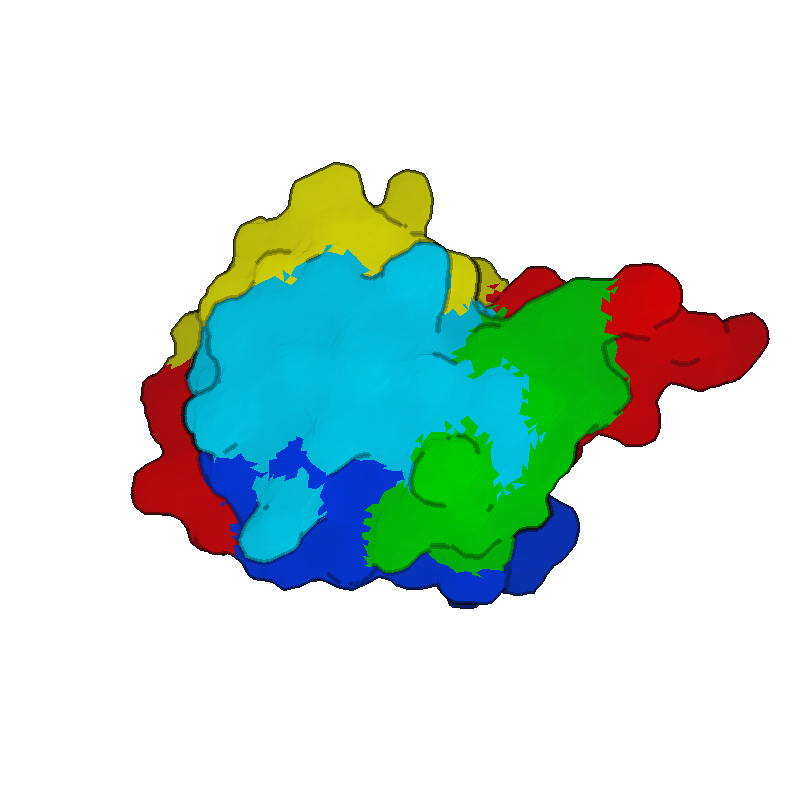

<p align="center">
  <strong>MolTerm</strong> — Terminal-based Molecular Viewer
  <br>
  <em>VIM-like interface &bull; Unicode &amp; pixel rendering &bull; PyMOL export</em>
</p>

<p align="center">
  
  
  
  
</p>

---

MolTerm renders 3D molecular structures directly in the terminal. It targets structural biologists and computational chemists who live in the terminal and want quick molecule inspection without launching a full GUI.

<p align="center">
  
  <br>
  <em>4HHB hemoglobin hetero-tetramer (α2β2) — cartoon polymer (elliptical helix tubes, smoothstep SS transitions, chain coloring) with HEM ligands as element-colored wireframe. Rendered offscreen in pixel mode at 300 DPI.</em>
</p>

### Press <code>m</code> — terminal-only Braille becomes pixel-perfect

<p align="center">
  
  <br>
  <em>Left: Unicode Braille — works in any terminal, no graphics protocol required.<br>
      Right: native pixel protocol (Sixel / Kitty / iTerm2) — toggled with one keypress (<code>m</code>).</em>
</p>

### Representation gallery

Each protein-rendering mode on `1ubq` (76-residue ubiquitin), 800×800 @
300 DPI, hero preset (`csd 24`, outline on, fog 0.4). Switch live with
the `s<key>` / `x<key>` keymaps or `:show <repr>`.

<table>
  <tr>
    <td align="center"><br><sub><code>show wireframe</code> · <code>color element</code></sub></td>
    <td align="center"><br><sub><code>show ballstick</code> · <code>color element</code></sub></td>
    <td align="center"><br><sub><code>show spacefill</code> · <code>color chain</code></sub></td>
  </tr>
  <tr>
    <td align="center"><br><sub><code>show cartoon</code> · <code>color secondary</code></sub></td>
    <td align="center"><br><sub><code>show surface</code> · <code>color rainbow</code></sub></td>
    <td align="center"><br><sub><code>show backbone</code> · <code>color rainbow</code></sub></td>
  </tr>
</table>

### DNA and nucleic acids

<p align="center">
  
  <br>
  <em>1bna — flat-ribbon nucleic backbone. Bases rendered as polygonal prisms following actual ring atom positions: hexagonal pyrimidines (C/T in blue/cyan), L-shaped fused bicyclic purines (A/G in red/green), each with a thin stem connecting to C1' of the sugar.</em>
</p>

## Features

- **Smart defaults** — auto-detects protein/nucleic/ligand content: cartoon for macromolecules, wireframe for ligands, chain coloring (`gd` / `:preset` to re-apply)
- **3-tier bond detection** — standard residue table (20 AA + 8 nucleotides, with bond order) → inter-residue peptide/phosphodiester bonds → distance fallback for ligands
- **Multi-renderer pipeline** — Unicode Braille (8x resolution), half-block, ASCII, and native pixel protocols (Sixel, Kitty, iTerm2) with auto-detection
- **VIM-like modal interface** — Normal, Command, Search modes with trie-based multi-key bindings (`sw`, `dd`, `gt`, etc.)
- **Rich representations** — wireframe, ball-and-stick, spacefill, cartoon (Catmull-Rom spline + elliptical/tubular helix + tension-tuned spline + 3-point frame smoothing + smoothstep SS transitions + nucleic flat-ribbon backbone + hexagonal/bicyclic base ring prisms; `:set cartoon_mode pymol` swaps in PyMOL's cartoon profiles — oval helix, barbed-arrow strand, round loop), flat ribbon, backbone trace, molecular surface (marching-cubes SES/SAS/vdW/Gaussian, solvent-excluded by default) — per-object or per-selection visibility
- **Selection algebra** — recursive descent parser: `chain A and helix`, `resi 50-60 or name CA`, boolean `and/or/not` with parentheses
- **Mouse selection** — `gs`/`gS`/`gc` pick modes for atom/residue/chain selection with `$sele` highlight overlay
- **Multi-level inspect** — click to inspect at atom/residue/chain/object level (`I` cycles), pick registers pk1-pk4 for measurements
- **Biological assemblies** — generate quaternary structures from PDB/mmCIF symmetry operators (`:assembly`)
- **Structure alignment** — TM-align and MM-align via USalign integration
- **PCA-aligned camera** — `:orient` runs full 3×3 eigendecomposition of atom positions; `:orient view <vx> <vy> <vz>` views the molecule along any direction expressed in its own PCA frame (e1=longest, e2=middle, e3=shortest)
- **Online fetch** — download from RCSB PDB (`fetch 1abc`) and AlphaFold DB (`fetch afdb:P12345`)
- **Headless batch mode** — `--no-tui` (or auto when stdout isn't a TTY) skips the alt-screen entirely so scripts render without flicker
- **Session management** — auto-save on quit, `--resume` to restore, `:save` for manual save
- **PyMOL session export** — `.pml` scripts with `set_view`, repr, coloring
- **Silhouette outlines** — depth edge detection with configurable threshold/darkness (pixel mode)
- **Screenshot from any renderer** — `:screenshot` renders offscreen via PixelCanvas even in braille/ASCII mode
- **Multi-state animation** — NMR ensemble / trajectory state cycling with `[`/`]` keys
- **Measurement tools** — `:measure` (incl. closest-approach between multi-atom groups), `:angle`, `:dihedral` with pk1-pk4 pick registers, serial numbers, or `(selection)` endpoints; `:rmsd` (non-destructive RMSD of two selections); `:hbonds` / `:saltbridge` / `:disulfide` auto-detect and draw interactions as 3D dashed contacts; `:bond`/`:unbond` for explicit connectivity in headless figures
- **Interface overlay** — `:interface` inter-chain contacts (closest heavy atom) with configurable dashed lines (works in all renderers including pixel mode); dashed lines respect z-buffer so atoms in front occlude them
- **Focus mode** — `gf`+click or `F` zoom to subject's bounding sphere; subject-size aware (one residue → tight, full chain → fits screen) with `focus_fill`/`focus_extra` knobs; granularity selectable (residue/chain/sidechain)
- **DSSP secondary structure** — full Kabsch-Sander pipeline: turns ▶ helices (3₁₀ / α / π) ▶ bridges (parallel / antiparallel) ▶ ladders with bulge propagation ▶ sheets, collapsed to molterm's 3-class SS. Auto-runs on load when no HELIX/SHEET headers exist. **Per-state cached** so trajectory frames (NMR/MD) get fresh SS when cycling with `[`/`]`. Re-run with `:dssp`. Validated against `mkdssp 4.5`: 13/15 PDB test structures match at 100% (4HHB, 1PGA, 1BTA, 1UBQ, 1ACJ, 1MBN, 1HHO, 1LMB, 2HHB, 2NLS, 2GB1, 1L2Y, 1CRN); 1AKE/7TIM at 99% (residual mismatches are H-bonds at exactly the −0.5 kcal/mol cutoff, where float precision flips the boundary)
- **SASA (solvent accessibility)** — faithful port of the PDB-REDO/dssp accessibility model: 401-point Fibonacci surface-dot integration with dssp-specific atom radii. `:sasa` reports total / per-chain area (Ų) and mean relative accessibility; `:color sasa` (or `ca`) shades buried→exposed (relative to Tien-2013 max-ASA). **Per-state cached** like DSSP. Validated against `mkdssp 4.x`: 1CRN/1UBQ/1KX5 match to <0.1% total SASA (per-residue diffs are just mkdssp's integer rounding)
- **Full customization** — keybindings, color themes, and settings via TOML configs in `~/.molterm/`
- **Structured logging** — session log to `~/.molterm/molterm.log`

## Quick Start

```bash
# Install latest release (macOS arm64, Linux x86_64/aarch64)
curl -fsSL https://raw.githubusercontent.com/vv137/molterm/main/scripts/update.sh | bash
# installs to ~/.local/bin/molterm. Override:
#   ./scripts/update.sh /usr/local/bin/molterm
#   MOLTERM_BIN=./build/molterm ./scripts/update.sh

# Or build from source
mkdir build && cd build
cmake .. -DCMAKE_BUILD_TYPE=Release
make -j$(nproc)

# Run
./molterm protein.pdb
./molterm structure.cif.gz             # gzipped files supported
./molterm --resume                     # restore last session (auto-saved on quit)
./molterm -r                           # short form
./molterm --script setup.mt            # run a command script after load (also -s)
./molterm --script setup.mt --strict   # abort on first script error (exit 1)
./molterm --script render.mt --no-tui  # batch render: no UI, no flicker
./molterm --help                       # full CLI help (also -h)
./molterm --version                    # prints version + git hash
```

### Headless screenshot example

A small script that fetches a PDB, orients the camera, switches to
cartoon, and writes a 1920×1080 PNG without ever opening a visible
viewport:

```text
# render.mt
fetch 1crn
hide all
show cartoon
color secondary
orient view 1 1 1
screenshot 1crn.png 1920 1080
quit
```

```bash
./molterm --script render.mt --no-tui
# → writes 1crn.png (1920×1080) into the cwd
```

`--no-tui` is auto-enabled whenever `--script` is used and stdout is
not a TTY (so piping or redirecting works the same way), and `--tui`
forces the UI on if you want to watch it run. `:screenshot file.png
[width height]` works from any renderer; the optional pixel dimensions
default to the live viewport (small under no-TTY) and are clamped to
64..8192 px.

### Camera orientation: `:orient view`

`:orient` aligns the camera to the molecule's principal axes via PCA
(largest variance → screen X, middle → Y, smallest → Z). `:orient view
<vx> <vy> <vz>` then chooses *which direction in that PCA frame the
camera looks from*. Default is `0 0 1`: down the shortest axis, so the
flattest face of the molecule fills the screen.

The vectors are interpreted in the PCA basis, so the same view spec
gives a comparable framing across structures of different sizes and
orientations.

### Spinning animations: `:turn`

`:orient view` recomputes PCA on every call. For sweeping the camera
through many frames, do PCA once and then use `:turn x|y|z <deg>` to
apply incremental rotations around the screen axes:

```text
# spin.mt — 60 frames, ~6° per frame
load ./protein.pdb
show cartoon
orient view 0 0 1
# repeat 60×:
turn y 6
screenshot frames/f001.png 800 800
turn y 6
screenshot frames/f002.png 800 800
...
```

`:turn` skips the eigendecomposition entirely; only the camera rotation
matrix is updated. Combine with `ffmpeg -i frames/f%03d.png out.mp4`.

### Multi-model alignment: `:loadalign`

For comparing many models of the same molecule (AlphaFold ensembles,
CASP submissions, MD snapshots, NMR states), `:loadalign` glob-loads
files and superposes models 2..N onto the first in one step:

```text
:loadalign relaxed_model_*.pdb              " all *.pdb in cwd
:loadalign relaxed_model_{1..5}.pdb         " brace expansion
:loadalign models/*.cif mm                  " force MM-align (multi-chain)
```

A trailing **selection** is applied to *both* sides of every alignment —
useful for superposing on the confident core of an AlphaFold ensemble
while letting flexible loops or low-pLDDT regions float:

```text
:loadalign model_?.cif chain A+B            " align on chains A and B only
:loadalign af2_*.pdb resi 50-200            " align on the structured domain
:loadalign nmr_*.cif backbone               " backbone-only superposition
```

The split between file patterns and selection is the first token that
begins a Selection keyword (`chain`, `resi`, `pepseq`, `not`, …) —
see the **Selection Algebra** section. Selection comes after the
patterns, before any optional `tm`/`mm` mode.

`:alignto` gives you per-call control once everything is loaded:

```text
:alignto ref                                " every other obj → ref
:alignto chain A to ref chain A             " current obj's chain A → ref's chain A
:alignto chain A+B to model chain A+B       " same object on both sides is OK
                                            " (intra-object selection alignment)
```

**`automap`** trails `:align` / `:alignto` / `:loadalign` when the same
complex was deposited with different chain labels (e.g. TCR-pMHC where
one structure is A=HLA, B=β2m, C=peptide, D=TCRα, E=TCRβ and another
reorders to C=HLA, D=β2m, E=peptide, A=TCRα, B=TCRβ). It forces MM mode
and drops any caller-supplied selection so USalign sees the whole
assembly — USalign-MM (`-mm 1`) handles chain pairing + permutation
internally.

```text
:align top1_bt2 to ref_8yiv automap         " let USalign pair the chains
:alignto ref_8yiv automap                   " same, broadcast over the tab
```

`automap` rejects free-form per-side `chain X` / `chain X+Y` selections;
either strip them and let USalign do the matching, or use the
`chain=A,B,…` shorthand (issue #81) below — it's `automap`-compatible.

**`chain=A,B,…`** (issue #81) trails `:align` / `:alignto` / `:loadalign`
to restrict both sides to the listed chain IDs without writing the
verbose `chain A or chain B or …` expression. Use `chain1=`/`chain2=`
for asymmetric per-side filters:

```text
:align mob to ref chain=C,D,E                " pMHC-only superposition
:alignto ref chain=C,D,E                     " broadcast pMHC anchor
:align mob to ref automap chain=C,D,E        " auto-pair within the C,D,E subset
:align mob to ref chain1=A,B chain2=H,L      " heavy/light → A/B mapping
```

The chain list is folded into the selection expression before USalign
sees the temp PDB, so the same atom-level filter that drove per-side
`[sel]` arguments before now drives this shorthand — `chain=` and a
literal `chain X or chain Y` expression are interchangeable.

### Multi-object workflow

After `:loadalign` (or any multi-load), per-object commands (`:color`,
`:show`, `:hide`, the hotkey repr toggles, `:zoom`, `:center`, `:orient`)
fan out across **every loaded object** by default. PyMOL semantics: a
bare selection is interpreted per-object; narrow it with one of:

- **`obj <name>` keyword** — `chain E and obj model` (anywhere in the expression).
- **Slash form** `/objname/chain/resi/name` — `:color red /1abc/A//CA` (legacy).
- **Object-qualified parens** `<objname>/(<expr>)` (issue #37) — most readable
  for nested expressions: `:zoom 1ubq/(chain A and resi 50-80)`. Wildcard form
  `all/(<expr>)` and `*/(<expr>)` is symmetric to a bare `(<expr>)` but explicit
  about the intent. PDB-style digit-led names (`1ubq`, `7tcr`) work as the
  object qualifier without quoting. As of #55, `:count`, `:cmp`, and
  `:set transparency` resolve obj-qualified selections against the named
  object even when it isn't the `:object` current — previously they were
  pinned to the current object and silently returned 0 atoms.

`:zoom` / `:center` / `:orient` also skip `:disable`d objects in
broadcast mode — a disabled crystal reference loaded alongside a model
won't drag the camera bounding box off-canvas. Switch to
`:set scope current` (or `:!zoom`) if you need to frame a single
disabled object explicitly.

```text
:loadalign relaxed_model_*.pdb              " load + superpose 5 models
:color rainbow                              " all 5 colored rainbow
:color red, obj 1ubq                        " just one object
:color blue, /relaxed_model_3/A//           " chain A of one specific model (slash form)
:show ballstick model/(chain E)             " obj-qualified parens — only the named object
:hide cartoon crystal/(chain *)             " hide cartoon for everything in `crystal`
:color magenta model/(chain E and resi 7)   " arbitrary expression inside the parens
:zoom chain A                               " camera frames the union of chain A across all 5
```

Two knobs control scope:

```vim
:set scope current               " single-object mode (legacy behavior)
:set scope all                   " multi-object mode (default)
:get scope                       " query

:color! red, chain A             " ! flips scope for this one call
:show! cartoon                   "   (handy with scope=all when you want to
                                 "    tweak the current object only)
```

`:set scope current` in `~/.molterm/init.mt` restores the pre-multi-object
behavior permanently. Structure-mutating commands (`:delete`, `:rename`,
`:bond`, `:unbond`, `:assembly`) always operate on the current object
regardless of scope — switch the current object explicitly with
`:object`:

```vim
:object                          " print the current object's name + index
:object 1ubq                     " switch to that object by name
:object 2                        " switch by 1-based index (matches :objects)
:object next                     " cycle forward (also Tab in Normal mode)
:object prev                     " cycle backward
:copy [<obj-or-sel>] [as <name>] " Clone an object OR a selection's atoms.
                                "   Object form: whole-object deep copy (atoms,
                                "   bonds, reprs, colors, alpha). Defaults to
                                "   current; auto-names <name>_copy.
                                "   Selection form: subset() + bond-remap — keeps
                                "   only the matching atoms; bonds survive iff
                                "   both endpoints are kept; per-atom state
                                "   (color, alpha, repr masks) carries over.
                                "   Auto-names <name>_subset.
                                "   Source unchanged either way (non-destructive).
                                "   Examples:
                                "     :copy 1ubq as backup
                                "     :copy chain A as just_A
                                "     :copy byres within 5 of $hem as binding_site
:extract <sel> [as <name>]       " Cut atoms out of the current object into a new
                                "   MolObject (destructive). Like :copy <sel> but
                                "   the source loses those atoms. Auto-names
                                "   <name>_extract. Refuses to extract every atom
                                "   (use :rename if that's what you want).
                                "   Useful for "carve TCR out of TCR-pMHC complex
                                "   for independent alignment" workflows.
:split [<obj>] by chain          " Build one new MolObject per chain of <obj>
                                "   (current if omitted). Source unchanged — :rm
                                "   it after if you want pure chain-objects.
                                "   Names: <obj>_<chainId>. Useful for per-chain
                                "   alignment, per-chain color, or splitting a
                                "   TCR-pMHC complex into its 4-5 functional units.
:rename [<old>] <new>            " Rename an object (one-arg form renames current)
:delete [<name>]                 " Delete an object (defaults to current). Also
                                "   removes it from the active tab, not just the
                                "   ObjectStore — prior versions could leave a
                                "   dangling shared_ptr in the tab when called
                                "   by name.
:rm [<name>]                     " Alias for :delete
```

### Analysis recipes — `:run @lib/<name>` (issue #56)

The `lib/` directory ships short, validated `.mt` scripts for named
structural metrics — TCR-pMHC crossing/incident angle, kinase αC/DFG
state, antibody Fab elbow, DNA bend, α-/TM-helix kink, domain hinge,
backbone φ/ψ — composed from the register primitives (`:let` / `pos()` /
`pca()` / `helix_axis()` / `superpose_axis()` / `dot()` / `angle()` /
`dihedral()`).

```vim
:setenv TCR_A D ; :setenv TCR_B E
:setenv MHC A   ; :setenv PEP C
:setenv MHC_HELIX1 50-85
:setenv MHC_HELIX2 138-175
:setenv TCRA_CYS23 22 ; :setenv TCRB_CYS23 23
:setenv PEP_FIRST 1   ; :setenv PEP_LAST 9
:run @lib/tcr_angles
:label corner topleft  = "crossing = ${crossing:.1f}°"
:label corner topright = "incident = ${incident:.1f}°"
```

Arguments can also be passed inline on the `:run` line (no `:setenv` needed;
quote any value with spaces or commas). Each recipe prints a one-line summary:

```vim
:run @lib/phi_psi CH=A PREV=24 RES=25 NEXT=26          " → phi/psi = -65.5/-44.4 deg
:run @lib/residue_scan SEL="chain A and resi 1-6" REF=A:76:CA
```

`@lib/<name>` resolves against this lookup chain (first match wins):

1. `$MOLTERM_LIB_DIR/<name>.mt`
2. `~/.molterm/lib/<name>.mt`              ← user library, writable
3. `<install-prefix>/share/molterm/lib/<name>.mt` ← shipped recipes
4. `<exe-dir>/../lib/<name>.mt`            ← build-tree layout
5. `<source-dir>/lib/<name>.mt`            ← dev fallback

Forks live at `~/.molterm/lib/`; shipped baselines stay untouched. See
[`lib/README.md`](lib/README.md) for the recipe catalog with required
env vars, output registers, and a validated PDB example per recipe.

The full scripting language — expression builtins, control flow (`:if`,
`:foreach` over ranges and selections, `:break`/`:continue`/`:return`),
`:def` functions, scope/export, and `:dump` JSON output — is documented in
[`docs/SCRIPTING.md`](docs/SCRIPTING.md).

Shipped recipes declare a `#!molterm scope=local export=<names>`
shebang, so they run in their own register frame and only the named
output registers (`$crossing`, `$incident`, …) propagate back to the
caller. Internal scratch (`$_hlx1`, `$_groove`, …) stays contained —
the `_`-prefix is enforced as private at frame pop, so even an
accidental `:expose _hlx1` would be rejected.

### High-quality rendering

PNGs from `:screenshot` are produced by `PixelCanvas` regardless of the
live renderer, so quality is controlled by these knobs. Inside a `.mt`
script file, drop the leading `:` — the colon is interactive command-mode
syntax only; scripts pass each line straight to the command registry:

```text
# render.mt — example settings file
screenshot out.png 2048 2048       # up to 8192×8192
screenshot out.png 1800 1200 300   # 6×4 in @ 300 DPI for journals
set sm relative                    # rough/final renders match (issue #48)
set csd 24                         # cartoon spline subdivisions  (def 14)
set ch  1.6                        # helix half-width  Å           (def 1.30)
set csh 1.8                        # sheet half-width  Å           (def 1.50)
set cl  0.30                       # loop  tube radius Å           (def 0.20)
set outline on                     # silhouette outlines (pixel)
set ot 0.2                         # outline depth threshold       (def 0.3)
set od 0.2                         # outline darken (0=black)      (def 0.15)
set fog 0.4                        # atmospheric depth fog 0-1     (def 0.35)
set surface_mode ses               # ses|sas|vdw|gaussian          (def ses)
set surface_probe 1.4              # SES/SAS probe radius Å 0-3.0  (def 1.4)
set surface_resolution 0.5         # surface grid spacing Å 0.2-3.0 (def 0.7)
set surface_scale 1.0              # blob radius (×vdW)    0.2-3.0 (def 1.0)
set surface_smoothness 2.0         # gaussian kernel k     0.5-8.0 (def 2.0)
set surface_iso 1.0                # gaussian iso-level    0.05-5.0 (def 1.0)
```

(Same commands as `:screenshot …`, `:set …` typed interactively.)

**Resolution-independent framing (issue #98):** `:focus`, `:zoom`, and
`:orient` fit the subject's *projected* extent to the **actual** output
frame, recomputed for every `:screenshot` size. A view tuned at 1200×900
fills the frame identically at 2400×1800 — same framing, just more pixels —
and the fit is aspect-aware, so a wide or tall canvas no longer leaves the
molecule small with dead margins. Combined with the default
`size_mode relative` (labels scale with the canvas), a single script
round-trips between rough and hi-DPI renders. Manual pan/zoom or
`:camera load` drops the auto-fit so an explicit pose is preserved.

**Script syntax:** `#` starts a comment that runs to end-of-line — anything
after it is ignored, *including* `;`. So `# step 1; step 2` is a single
comment, not two commands. `;` (outside a comment) separates commands on
one line, useful for `:setenv`-style preamble or piping with `molterm -s -`.
A `#` inside `"..."` or `'...'` is preserved as part of the quoted argument.

**Env-var substitution:** `${NAME}` is expanded against in-process vars set
via `:setenv NAME value`, falling through to the OS environment, with
empty-string on unset. Use `\$` to write a literal dollar.

```text
:setenv WS  /store/casp17/H2324
:setenv TGT H2324
:run ${WS}/scripts/00_setup.mt
:load ${WS}/models/top1_bt2.cif
:screenshot ${WS}/figures/${TGT}-overview.png 1280 960
```

Expansion happens *after* `;` splits, so `:setenv X foo; :load ${X}/y` works
in one line. `:setenv NAME` (no value) unsets; bare `:setenv` lists all.

The optional 4th `screenshot` arg stamps a PNG `pHYs` chunk so LaTeX,
Word, and image viewers know the intended physical print size — pixel
count is unchanged, only metadata. Pick pixels = inches × DPI: a
6×4-inch journal figure at 300 DPI is `1800 1200 300`.

For a hero figure: 2048², `csd 24`, outline on, `fog 0.4`. For an
animation, drop to 800-1024² and lower `csd` if frame time matters.

### Dependencies

| Dependency | Version | Source |
|------------|---------|--------|
| **gemmi** | v0.7.0 | FetchContent (automatic) |
| **USalign** | latest | FetchContent (automatic) |
| **toml++** | v3.4.0 | FetchContent (automatic) |
| **ncurses** | system | `apt install libncurses-dev` / `brew install ncurses` |
| **zlib** | system | Usually pre-installed |

All C++ dependencies are fetched automatically by CMake. Only ncurses and zlib need to be installed on the system.

---

## Usage

### VIM-like Modes

| Mode | Entry | Exit | Purpose |
|------|-------|------|---------|
| **Normal** | `ESC` / `Ctrl+C` | — | Navigation, object manipulation, mouse inspect/select |
| **Command** | `:` | `ESC`, `Enter` | Typed commands with tab completion |
| **Search** | `/` | `ESC`, `Enter` | Selection expression search, `n`/`N` navigate |

### Keybindings (press `?` for in-app cheat sheet)

<details>
<summary><strong>Navigation</strong></summary>

| Key | Action |
|-----|--------|
| `h`/`j`/`k`/`l` or arrows | Rotate molecule |
| `W`/`A`/`S`/`D` | Pan view |
| `+`/`-` | Zoom in/out |
| `<`/`>` | Z-axis rotation |
| `0` | Reset view |
| `.` | Repeat last action |
| Scroll wheel | Zoom |

</details>

<details>
<summary><strong>Representations</strong> — <code>s</code>=show, <code>x</code>=hide</summary>

| Key | Action |
|-----|--------|
| `sw` / `xw` | Wireframe |
| `sb` / `xb` | Ball-and-stick |
| `ss` / `xs` | Spacefill (CPK) |
| `sc` / `xc` | Cartoon (3D tube) |
| `sr` / `xr` | Ribbon (flat) |
| `sk` / `xk` | Backbone trace |
| `:show surface` | Molecular surface (no default key) |
| `xa` | Hide all |
| `so` / `xo` | Show / hide overlays (labels, measurements, sele) |
| `gd` | Apply default preset (cartoon + ballstick ligands) |

</details>

<details>
<summary><strong>Coloring</strong> — <code>c</code> prefix</summary>

| Key | Scheme |
|-----|--------|
| `ce` | Heteroatom element (N=blue O=red S=yellow, carbon unchanged) |
| `cc` | Chain |
| `cs` | Secondary structure |
| `cb` | B-factor |
| `cp` | pLDDT (AlphaFold confidence) |
| `cr` | Rainbow (N→C terminus) |
| `ct` | Residue type (nonpolar/polar/acidic/basic) |
| `ca` | SASA / accessibility (buried→exposed) |

</details>

<details>
<summary><strong>Objects, Tabs &amp; Other</strong></summary>

| Key | Action |
|-----|--------|
| `Tab` / `Shift+Tab` | Next/prev object |
| `Space` | Toggle visibility |
| `dd` | Delete object |
| `yy` / `p` | Yank / paste object |
| `gt` / `gT` | Next/prev tab |
| `Ctrl+T` / `Ctrl+W` | New/close tab |
| `o` | Toggle object panel |
| `i` | Inspect info (shows current level) |
| `I` | Cycle inspect level (atom/residue/chain/object) |
| Click | Inspect at current level (stores pk1→pk4 registers) |
| `gs` | Enter atom select mode (click to toggle atoms in `$sele`) |
| `gS` | Enter residue select mode (click to toggle residues) |
| `gc` | Enter chain select mode (click to toggle chains) |
| `gf` | Enter focus pick mode (click to focus) |
| `gx` | Clear `$sele` and pk1-pk4 |
| `ESC` | Exit pick mode / exit focus session / cancel pending |
| `[` / `]` | Prev/next state (NMR ensembles) |
| `m` | Toggle braille/pixel renderer |
| `P` | Screenshot (PNG, pixel renderer) |
| `I` | Toggle interface overlay |
| `F` | Focus on picked residue (subject-size aware zoom); press again to exit |
| `q` + `a-z` | Record macro |
| `@` + `a-z` | Play macro |
| `b` | Toggle sequence bar (visible / hidden) |
| `{` / `}` | Sequence bar prev/next chain |
| `?` | Help overlay |

</details>


## Documentation

The full reference lives in [`docs/`](docs/):

- **[Commands](docs/COMMANDS.md)** — every `:command`, including the full `:set` option list.
- **[Selection Algebra](docs/SELECTIONS.md)** — the selection language (`chain`, `resi`, `within`, boolean ops, `/obj/...`).
- **[Scripting](docs/SCRIPTING.md)** — the `.mt` scripting language (`:let`, `:foreach`, `:def`, registers, `${var}`).
- **[Roadmap](docs/ROADMAP.md)** — implementation status and planned work.

The `### Commands` and `### Selection Algebra` references moved out of this README
to keep it scannable; press `?` in-app for the keybinding cheat sheet and
`:help <cmd>` for per-command help.
## Rendering

### Canvas Backends

| Backend | Resolution | Characters | Best for |
|---------|------------|------------|----------|
| **BrailleCanvas** (default) | 8× (2×4 sub-pixels) | Unicode Braille `⠀`–`⣿` | SSH, most terminals |
| **BlockCanvas** | 2× (1×2 sub-pixels) | Half-blocks `▀▄█` | Wide compatibility |
| **AsciiCanvas** | 1× | `* @ - \| /` | Legacy terminals |
| **PixelCanvas** | Native pixels | Sixel / Kitty / iTerm2 | Local terminals with graphics support |

**PixelCanvas features:** sphere shading (Half-Lambert), line shading, depth fog, frame diff, adaptive frame skip, LOD for >10K atoms.

Switch at runtime: `:set renderer braille|block|ascii|pixel` or `m` to toggle.

### Color Schemes

| Scheme | Key | Description |
|--------|-----|-------------|
| Heteroatom | `ce` | N=blue O=red S=yellow P=magenta (carbon unchanged) |
| Chain | `cc` | 12-color cycle (green, cyan, magenta, yellow, red, blue, orange, lime, teal, purple, pink, slate) |
| Secondary structure | `cs` | Helix=red Sheet=yellow Loop=green |
| B-factor | `cb` | Blue→Green→Red gradient |
| pLDDT | `cp` | AlphaFold confidence (>90 blue, 70-90 light blue, 50-70 yellow, <50 orange) |
| Rainbow | `cr` | Per-chain N→C terminus blue→red gradient |
| Residue type | `ct` | VMD-like: nonpolar (white), polar (green), acidic (red), basic (blue) |
| SASA | `ca` | Relative accessibility: buried ≤10% (blue), 10–40% (gray), exposed ≥40% (red) |

**Per-atom coloring:** `:color <name> [selection]` — 15 named colors: `red green blue yellow magenta cyan white orange pink lime teal purple salmon slate gray`

---

## Customization

Configuration files in `~/.molterm/`:

```
~/.molterm/
├── config.toml          # general settings (default renderer, auto-center, etc.)
├── keymap.toml          # custom keybindings (overrides defaults)
├── colors.toml          # custom color schemes
├── init.mt              # auto-run command script (optional)
└── molterm.log          # session log (auto-created)
```

<details>
<summary><strong>init.mt — startup command script</strong></summary>

If `~/.molterm/init.mt` exists, MolTerm runs it on startup right after commands are registered, before any positional file args, `--script`, or `--resume`. Use it for preferred defaults so they apply to every session. Failures are logged to `molterm.log` but never abort startup (CLI `--strict` only applies to `--script`, not `init.mt`).

```text
# ~/.molterm/init.mt — no leading `:` in script files
set renderer pixel
set fog 0.4
set outline on
```

</details>

<details>
<summary><strong>keymap.toml example</strong></summary>

```toml
[normal]
"h"         = "rotate_left"
"j"         = "rotate_down"
"k"         = "rotate_up"
"l"         = "rotate_right"
"H"         = "pan_left"
"J"         = "pan_down"
"K"         = "pan_up"
"L"         = "pan_right"
"+"         = "zoom_in"
"-"         = "zoom_out"
"0"         = "reset_view"
"gt"        = "next_tab"
"gT"        = "prev_tab"
"<C-t>"     = "new_tab"
"<C-w>"     = "close_tab"
"sw"        = "show_wireframe"
"sb"        = "show_ballstick"
"sc"        = "show_cartoon"
"sr"        = "show_ribbon"
"ce"        = "color_by_element"
"cc"        = "color_by_chain"
"/"         = "enter_search"
"?"         = "show_help"
"["         = "prev_state"
"]"         = "next_state"

[command]
"<CR>"    = "execute"
"<Esc>"   = "exit_to_normal"
"<Tab>"   = "autocomplete"
```

</details>

<details>
<summary><strong>All bindable actions</strong></summary>

**Navigation:** `rotate_left`, `rotate_right`, `rotate_up`, `rotate_down`, `rotate_cw`, `rotate_ccw`, `pan_left`, `pan_right`, `pan_up`, `pan_down`, `zoom_in`, `zoom_out`, `reset_view`, `center_selection`, `redraw`

**Representations:** `show_wireframe`, `show_ballstick`, `show_spacefill`, `show_cartoon`, `show_ribbon`, `show_backbone`, `hide_wireframe`, `hide_ballstick`, `hide_spacefill`, `hide_cartoon`, `hide_ribbon`, `hide_backbone`, `hide_all`, `show_overlay`, `hide_overlay`, `apply_preset`

**Coloring:** `color_by_element`, `color_by_chain`, `color_by_ss`, `color_by_bfactor`, `color_by_plddt`, `color_by_rainbow`, `color_by_restype`, `color_by_sasa`

**Objects:** `next_object`, `prev_object`, `toggle_visible`, `delete_object`, `yank_object`, `paste_object`, `rename_object`, `toggle_panel`

**Tabs:** `next_tab`, `prev_tab`, `new_tab`, `close_tab`, `move_to_tab`, `copy_to_tab`

**Modes:** `enter_command`, `enter_search`, `exit_to_normal`

**Search:** `search_next`, `search_prev`

**Inspect / Selection:** `inspect`, `cycle_inspect_level`, `enter_select_atom`, `enter_select_residue`, `enter_select_chain`

**State:** `prev_state`, `next_state`

**Other:** `show_help`, `undo`, `redo`, `repeat_last`, `toggle_pixel`, `toggle_seqbar`, `seqbar_next_chain`, `seqbar_prev_chain`, `screenshot`, `start_macro`, `play_macro`, `toggle_interface`

**Command mode:** `execute`, `autocomplete`, `history_prev`, `history_next`, `delete_word`, `clear_line`

**Command line editing:** `Left`/`Right` cursor, `Home`/`Ctrl+A` start, `End`/`Ctrl+E` end, `Del` forward delete, `Ctrl+W` delete word, `Ctrl+U` clear

</details>

<details>
<summary><strong>colors.toml example</strong></summary>

```toml
[schemes.element]
C  = "green"
N  = "blue"
O  = "red"
S  = "yellow"
P  = "magenta"
H  = "white"
_default = "white"

[schemes.chain]
_cycle = ["green", "cyan", "magenta", "yellow", "red", "blue",
          "orange", "lime", "teal", "purple", "pink", "slate"]

[schemes.ss]
helix = "red"
sheet = "yellow"
loop  = "green"

[schemes.bfactor]
gradient = ["blue", "green", "red"]
min = 0.0
max = 100.0
```

</details>

---

## Architecture

```
molterm/
├── CMakeLists.txt
├── include/molterm/
│   ├── app/         Application, TabManager, Tab, ScriptRunner, ViewSettings;
│   │                owned state clusters: FocusState, InterfaceOverlay, OverlayAnnotations
│   ├── analysis/    ContactMap (interface detection, distance matrix)
│   ├── core/        MolObject, AtomData, BondData, Selection, ObjectStore, SpatialHash,
│   │                StringParse (no-throw numeric parsing), Logger
│   ├── io/          CifLoader, PdbWriter, Aligner, SessionExporter, SessionSaver, CcdCache
│   ├── render/      Canvas (Braille/Block/Ascii/Pixel), Camera, ColorMapper, DepthBuffer
│   │                GraphicsEncoder (Sixel/Kitty/iTerm2), ProtocolPicker
│   ├── repr/        Representation (Wireframe/BallStick/Backbone/Spacefill/Cartoon/Ribbon)
│   ├── tui/         Screen, Window, Layout, StatusBar, CommandLine, TabBar, ObjectPanel,
│   │                SeqBar, DensityMap, ContactMapPanel
│   ├── input/       InputHandler, Keymap (trie), KeymapManager, Action, Mode
│   ├── cmd/         CommandParser, CommandRegistry, UndoStack, commands/ (per-area handlers)
│   └── config/      ConfigParser (TOML)
└── src/             .cpp implementations mirror include/ structure
```

> **Application decomposition.** `Application` owns the app-wide subsystems but
> delegates cohesive state to small owned clusters reached via accessors —
> `view()` (ViewSettings), `focus()` (FocusState), `interface()` (InterfaceOverlay),
> and `annotations()` (OverlayAnnotations) — so the central header stays lean and
> each concern lives in one place.

### Rendering Pipeline

```
MolObject → Representation → Canvas → Window (ncurses)
                 ↑                ↑
   ColorMapper (scheme)     Camera (3×3 rot + pan + zoom)
```

### Coding Conventions

- **C++17** strict — no exceptions in hot paths
- Parse user/file/script numbers with `core/StringParse.h` (`parseInt`/`parseFloat`,
  no-throw `std::optional`), never raw `std::stoi`/`std::stof`; the command
  dispatcher also has a try/catch backstop so a stray throw can't kill the session
- `std::unique_ptr` / `std::shared_ptr` with clear ownership
- `enum class` over raw enums
- `#pragma once` for header guards
- **Naming:** `PascalCase` types, `camelCase` methods/variables, `UPPER_SNAKE` constants
- All ncurses calls through `Screen`/`Window` wrappers
- Separate concerns: parsing (io/), model (core/), rendering (render/ + repr/), TUI (tui/), input (input/), commands (cmd/)

---

## PyMOL Export

Export the current session as a `.pml` script that reconstructs the view in PyMOL:

```
:export session.pml
```

Generates `load`, `show`, `color`, `select`, and `set_view` commands with the current camera matrix.

---

## License

MIT
